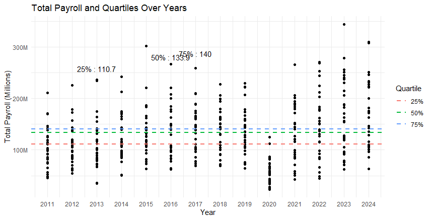
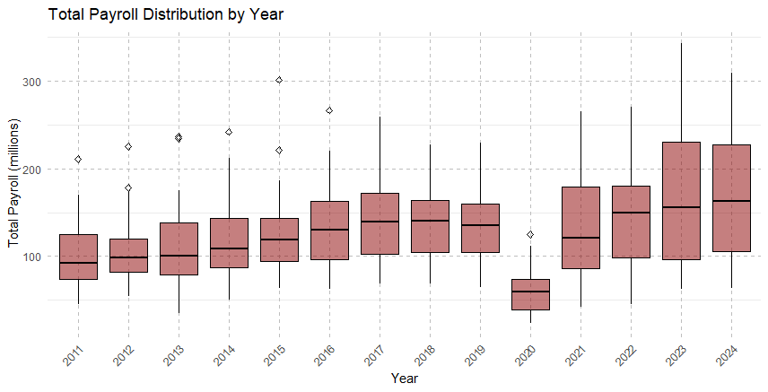
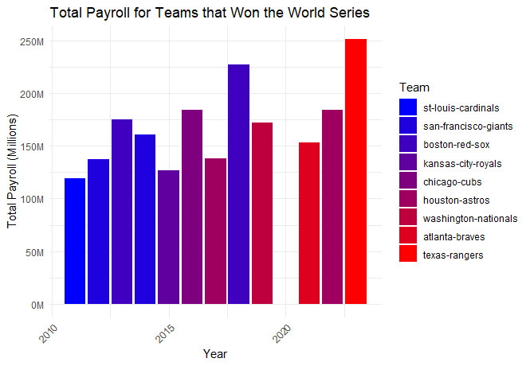
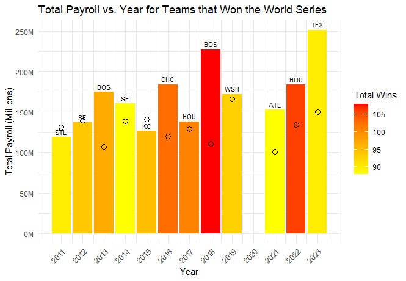

---
# Exploratory Data Analysis of MLB Payroll Data
---

**Libraries Used:**   
library(ggplot2)  
library(dplyr)  
library(tidyr)  
library(shiny)  
library(scales)  
library(forcats)  

``` r
df <- read.csv("C:/Users/colet/Documents/Personal Projects/Completed_MLB_Payroll_Data.csv")

#Checking where the NA's are
colSums(is.na(df))
#Checking to make sure the datatypes are what they should be
str(df)
```

It is expected for there to be missing values in Previous year payroll, percent change and difference for 2011 (there is
no prior data). 
Also, the high amount of missing values in the suspended column is also expected and ok, there shouldnt be players getting suspended
too often. 

$ Team: chr - $ Year: int - $ Payroll.Ranking: int - $ Total.Payroll: int - 
$ League.Average.Payroll: num - $ Previous.Year.Payroll : int - $ Payroll.Percent.Change: num  
$ Payroll.Difference: int - $ Active.Payroll: int - $ Injured: num  
$ Retained : num - $ Buried : num - $ Suspended: num - $ Player: chr  
$ Pos: chr - $ Exp: num - $ Status: chr - $ Payroll.Salary : num  
$ Type: chr - $ Average.Age: num - $ W: int - $ L: int - $ W.L.: num  
$ World.Series: chr - $ ALCS : chr - $ NLCS: chr  
$ AL.Division.Series: chr - $ NL.Division.Series: chr - $ Wild.Card.Game : chr  


# Summary Statistics

```r
mean(df$League.Average.Payroll)
mean(df$Total.Payroll)
median(df$League.Average.Payroll)
median(df$Total.Payroll)
```

Mean of league average payroll - $128,717,202  
Mean of Total Payroll - $127,951,682 (Expected to be very very close to the same number)  
Median of League average payroll - $133,894,291
Median of total payroll - $116,341,526  

```r
print(paste("Minimum League Average Payroll value:", min(df$League.Average.Payroll, na.rm = TRUE), "Year:", df$Year[which.min(df$League.Average.Payroll)]))
print(paste("Maximum League Average Payroll value:", max(df$League.Average.Payroll, na.rm = TRUE), "Year:", df$Year[which.max(df$League.Average.Payroll)]))
print(paste("Minimum total payroll value:", min(df$Total.Payroll, na.rm = TRUE), "Year:", df$Year[which.min(df$Total.Payroll)]))
print(paste("Maximum total payroll value:", max(df$Total.Payroll, na.rm = TRUE), "Year:", df$Year[which.max(df$Total.Payroll)]))
```

Minimum League Average Payroll value: 61111950.1 Year: 2020    
Maximum League Average Payroll value: 165757214.666667 Year: 2023    
Minimum total payroll value: 23478635 Year: 2020  
Maximum total payroll value: 343605067 Year: 2023   


```r
# Compute quartiles for Total Payroll
quartiles <- quantile(df$Total.Payroll, probs = c(0.25, 0.5, 0.75), na.rm = TRUE)
# Find the corresponding years for each quartile
quartile_years <- sapply(quartiles, function(x) df$Year[which.min(abs(df$Total.Payroll - x))])
# Print the results
for (i in 1:length(quartiles)) {
  print(paste("Quartile", names(quartiles)[i], "value:", quartiles[i], "Year:", quartile_years[i]))
}
```
Quartile 25% value: 85269950 Year: 2024   
Quartile 50% value: 116341526 Year: 2012    
Quartile 75% value: 162160921 Year: 2015   

```r
#Compute quartiles for league average payroll
quartiles <- quantile(df$League.Average.Payroll, probs = c(0.25, 0.5, 0.75), na.rm = TRUE)
# Find the corresponding years for each quartile
quartile_years <- sapply(quartiles, function(x) df$Year[which.min(abs(df$League.Average.Payroll - x))])
# Print the results
for (i in 1:length(quartiles)) {
  print(paste("Quartile", names(quartiles)[i], "value:", quartiles[i], "Year:", quartile_years[i]))
}
```
Quartile 25% value: 110697780.6 Year: 2013  
Quartile 50% value: 133894290.63 Year: 2016    
Quartile 75% value: 140038982.6 Year: 2017    


# Visualizations

Plotting the Quartiles (with all years)  - This plot is messy but holds some insight

```r
quartiles_millions <- as.numeric(quartiles) / 1e6
quartile_data <- data.frame(
  Quartile = names(quartiles),
  Value = quartiles_millions,
  Year = quartile_years
)

# Plot the data
ggplot(df, aes(x = Year, y = Total.Payroll / 1e6)) +
  geom_point() +  # Scatter plot of all data points
  geom_hline(data = quartile_data, aes(yintercept = Value, color = Quartile), linetype = "dashed", size = 1) +
  geom_text(data = quartile_data, aes(x = Year, y = Value, label = paste(Quartile, ":", round(Value, 1))), vjust = -12) +
  labs(title = "Total Payroll and Quartiles Over Years",
       x = "Year",
       y = "Total Payroll (Millions)") +
  theme_minimal() +
  scale_y_continuous(labels = function(x) paste0(x, "M"))+  # Adjust y-axis labels to show values in millions
  scale_x_continuous(breaks = seq(min(df$Year), max(df$Year), by = 1))  # Include all years
```

  
  
---
Creating a boxplot for each year in one chart - this one is beautiful

```r
#customization of the box plot
ggplot(df, aes(x = as.factor(Year), y = Total.Payroll / 1000000)) +
  geom_boxplot(fill = "darkred", color = "black", alpha = 0.5, outlier.shape = 5) +  # Customize box plot appearance
  scale_y_continuous(labels = label_number_si()) +  # Format y-axis labels
  labs(title = "Total Payroll Distribution by Year",  # Add title and axis labels
       x = "Year",
       y = "Total Payroll (millions)") +
  theme_minimal() +  # Apply a minimal theme
  theme(axis.text.x = element_text(angle = 45, hjust = 1),  # Rotate x-axis labels
        panel.grid.major = element_line(color = "gray", linetype = "dashed"),  # Customize grid lines
        legend.position = "bottom")  # Adjust legend position
```

    
  
  This boxplot tells me that more teams are increasing their total payroll such that enough teams have increased payroll over this time so outliers no longer exist (in terms of team payroll) even the the maximum total payroll is at an all time high.
  Minimum payroll is not increasing by too much, telling me that there are larger discrepancies between teams and their payrolls. Would imagine sooner than later a minimum payroll would become the outlier. The median payroll kept a somewhat steady rise, 
  showing that the league is trending in a direction that spends more on total payroll (as expected).
  
---

### Analyzing the total payroll for each team that won the world series

Total Payroll and year with team's shown by color (not best way to show this)
```r
won_teams <- df[df$World.Series == "Won", ]
aggregate_payroll <- aggregate(Total.Payroll ~ Team + Year, data = won_teams, FUN = function(x) x[1])
team_order <- aggregate_payroll[order(aggregate_payroll$Year), "Team"]
aggregate_payroll$Team <- factor(aggregate_payroll$Team, levels = unique(aggregate_payroll$Team))
team_palette <- scale_fill_manual(values = colorRampPalette(c("blue", "red"))(length(unique(aggregate_payroll$Team))))
ggplot(aggregate_payroll, aes(x = Year, y = Total.Payroll / 1e6, fill = Team)) +
  geom_bar(stat = "identity") +
  labs(x = "Year", y = "Total Payroll (Millions)",
       title = "Total Payroll for Teams that Won the World Series",
       fill = "Team") +
  team_palette +  # Use the custom color palette
  theme_minimal() +
  scale_y_continuous(labels = function(x) paste0(x, "M")) +  # Format y-axis labels in millions
  theme(axis.text.x = element_text(angle = 45, hjust = 1))
```


---

Showing the number of wins through color gradeient, total payroll on the axis, and league average payroll for each year denoted by the empty circle

```r
won_teams <- df[df$World.Series == "Won", ]
team_stats <- won_teams %>%
  group_by(Team, Abbreviation, Year) %>%
  summarise(Total_Payroll = mean(Total.Payroll),  
            Total_Wins = mean(W)) %>%  # total wins for each team in each year
  ungroup()
team_stats <- team_stats %>%
  mutate(Team = fct_reorder(Team, Total_Wins, .desc = TRUE))
team_palette <- scale_fill_gradient(low = "yellow", high = "red",
                                    limits = range(team_stats$Total_Wins),
                                    breaks = pretty_breaks(n = 5))
ggplot(team_stats, aes(x = Year, y = Total_Payroll / 1e6, fill = Total_Wins, label = Abbreviation)) +
  geom_bar(stat = "identity", position = "dodge") +
  geom_point(aes(y = unique(df$League.Average.Payroll) / 1e6), color = "black", size = 3, shape = 1) +  # Add points for league average payroll
  labs(x = "Year", y = "Total Payroll (Millions)",
       title = "Total Payroll vs. Year for Teams that Won the World Series",
       fill = "Total Wins") +
  team_palette +  # Use the custom color palette
  theme_minimal() +
  scale_y_continuous(labels = function(x) paste0(x, "M")) +  # Format y-axis labels in millions
  scale_x_continuous(breaks = seq(min(df$Year), max(df$Year), by = 1)) +  # Include all years
  theme(axis.text.x = element_text(angle = 45, hjust = 1)) +  # Rotate x-axis labels for better readability
  geom_text(position = position_dodge(width = 0.9),    # Position dodge to match the bars
            vjust = -0.5,                              # Adjust vertical position for better visibility
            size = 3,                                  # Adjust text size
            color = "black",                           # Text color
            aes(label = Abbreviation))       
  
```
  

There's been a steady increase in the payroll by the world champion team, yet the number of season wins these teams have are sporadic. The most important note on this plot is seeing that since 2011, only 3 teams that are below the league average payroll for the year 
have actually won the world series. This should be an important identifier in determining a team's chances of winning the world series. 

---
