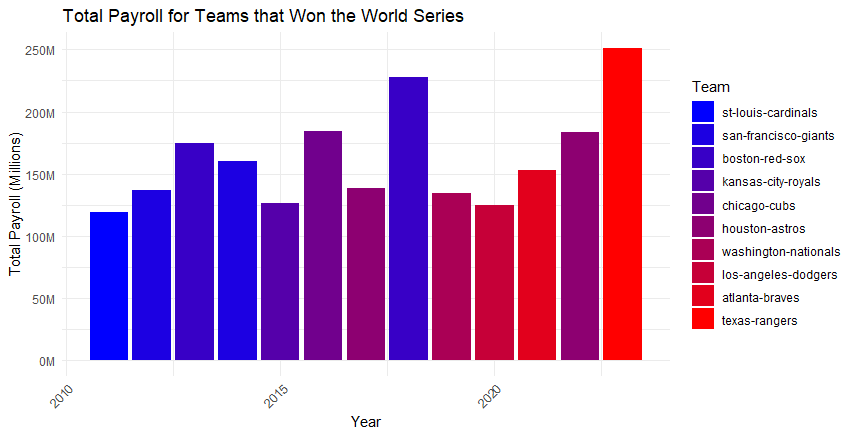

---
# Exploratory Data Analysis of MLB Payroll Data
---

**Libraries Used:**   
library(ggplot2)  
library(dplyr)  
library(tidyr)  
library(shiny)  
library(scales)  
library(forcats)  

``` r
df <- read.csv("C:/Users/colet/Documents/Personal Projects/Completed_MLB_Payroll_Data.csv")

#Checking where the NA's are
colSums(is.na(df))
#Checking to make sure the datatypes are what they should be
str(df)
```
```r
> colSums(is.na(df))
                  Team                   Year           Abbreviation        Payroll.Ranking          Total.Payroll 
                     0                      0                      0                      0                      0 
League.Average.Payroll  Previous.Year.Payroll Payroll.Percent.Change     Payroll.Difference         Active.Payroll 
                     0                   1272                   1272                   1272                      0 
               Injured               Retained                 Buried              Suspended                 Player 
                  4542                    383                   2497                  19000                      0 
                   Pos                    Exp                 Status         Payroll.Salary                   Type 
                     0                   6503                   4431                     68                      0 
           Average.Age                      W                      L                   W.L.           World.Series 
                     0                   1250                   1250                   1250                      0 
                  ALCS                   NLCS     AL.Division.Series     NL.Division.Series         Wild.Card.Game 
                     0                      0                      0                      0                      0
```

It is expected for there to be missing values in Previous year payroll, percent change and difference for 2011 (there is
no prior data).   
The high amount of missing values in the suspended column is also expected and ok, there shouldnt be players getting suspended
too often. Injured, retained, and buried are all expected to have missing values, as not every team has these parts of payroll every season.    
Experience and status has some missing values due to data quality. There wasn't always consistency across the website in terms of these fields being filled for every player.    
W, L, and W.L. should all have the same number of missing values, as these only pertain to the 2024 season (which will be predicted).   

$ Team: chr - $ Year: int - $ Payroll.Ranking: int - $ Total.Payroll: int -   
$ League.Average.Payroll: num - $ Previous.Year.Payroll : int - $ Payroll.Percent.Change: num    
$ Payroll.Difference: int - $ Active.Payroll: int - $ Injured: num    
$ Retained : num - $ Buried : num - $ Suspended: num - $ Player: chr    
$ Pos: chr - $ Exp: num - $ Status: chr - $ Payroll.Salary : num    
$ Type: chr - $ Average.Age: num - $ W: int - $ L: int - $ W.L.: num    
$ World.Series: chr - $ ALCS : chr - $ NLCS: chr    
$ AL.Division.Series: chr - $ NL.Division.Series: chr - $ Wild.Card.Game : chr    


# Summary Statistics

```r
mean(df$League.Average.Payroll)
mean(df$Total.Payroll)
median(df$League.Average.Payroll)
median(df$Total.Payroll)
```

Mean of league average payroll - $128,717,202  
Mean of Total Payroll - $127,951,682 (Expected to be very very close to the same number)  
Median of League average payroll - $133,894,291
Median of total payroll - $116,341,526  

```r
print(paste("Minimum League Average Payroll value:", min(df$League.Average.Payroll, na.rm = TRUE), "Year:", df$Year[which.min(df$League.Average.Payroll)]))
print(paste("Maximum League Average Payroll value:", max(df$League.Average.Payroll, na.rm = TRUE), "Year:", df$Year[which.max(df$League.Average.Payroll)]))
print(paste("Minimum total payroll value:", min(df$Total.Payroll, na.rm = TRUE), "Year:", df$Year[which.min(df$Total.Payroll)]))
print(paste("Maximum total payroll value:", max(df$Total.Payroll, na.rm = TRUE), "Year:", df$Year[which.max(df$Total.Payroll)]))
```

Minimum League Average Payroll value: $61,111,950 Year: 2020    
Maximum League Average Payroll value: $165,757,214 Year: 2023    
Minimum total payroll value: $23,478,635 Year: 2020  
Maximum total payroll value: $343,605,067 Year: 2023   


```r
# Compute quartiles for Total Payroll
quartiles <- quantile(df$Total.Payroll, probs = c(0.25, 0.5, 0.75), na.rm = TRUE)
# Find the corresponding years for each quartile
quartile_years <- sapply(quartiles, function(x) df$Year[which.min(abs(df$Total.Payroll - x))])
# Print the results
for (i in 1:length(quartiles)) {
  print(paste("Quartile", names(quartiles)[i], "value:", quartiles[i], "Year:", quartile_years[i]))
}
```
Quartile 25% value: $85,269,950 Year: 2024   
Quartile 50% value: $116,341,526 Year: 2012    
Quartile 75% value: $162,160,921 Year: 2015   

```r
#Compute quartiles for league average payroll
quartiles <- quantile(df$League.Average.Payroll, probs = c(0.25, 0.5, 0.75), na.rm = TRUE)
# Find the corresponding years for each quartile
quartile_years <- sapply(quartiles, function(x) df$Year[which.min(abs(df$League.Average.Payroll - x))])
# Print the results
for (i in 1:length(quartiles)) {
  print(paste("Quartile", names(quartiles)[i], "value:", quartiles[i], "Year:", quartile_years[i]))
}
```
Quartile 25% value: $110,697,780 Year: 2013  
Quartile 50% value: $133,894,290 Year: 2016    
Quartile 75% value: $140,038,982 Year: 2017    


# Visualizations

```r
quartiles_millions <- as.numeric(quartiles) / 1e6
quartile_data <- data.frame(
  Quartile = names(quartiles),
  Value = quartiles_millions,
  Year = quartile_years
)

# Plot the data
ggplot(df, aes(x = Year, y = Total.Payroll / 1e6)) +
  geom_point() +  # Scatter plot of all data points
  geom_hline(data = quartile_data, aes(yintercept = Value, color = Quartile), linetype = "dashed", size = 1) +
  geom_text(data = quartile_data, aes(x = Year, y = Value, label = paste(Quartile, ":", round(Value, 1))), vjust = -12) +
  labs(title = "Total Payroll and Quartiles Over Years",
       x = "Year",
       y = "Total Payroll (Millions)") +
  theme_minimal() +
  scale_y_continuous(labels = function(x) paste0(x, "M"))+  # Adjust y-axis labels to show values in millions
  scale_x_continuous(breaks = seq(min(df$Year), max(df$Year), by = 1))  # Include all years
```

  
  
This plot shows the distribution of total payroll across years (2020 is an outlier year, there was a reduction in payroll leaguewide)

---

```r
#customization of the box plot
ggplot(df, aes(x = as.factor(Year), y = Total.Payroll / 1000000)) +
  geom_boxplot(fill = "darkred", color = "black", alpha = 0.5, outlier.shape = 5) +  # Customize box plot appearance
  scale_y_continuous(labels = label_number_si()) +  # Format y-axis labels
  labs(title = "Total Payroll Distribution by Year",  # Add title and axis labels
       x = "Year",
       y = "Total Payroll (millions)") +
  theme_minimal() +  # Apply a minimal theme
  theme(axis.text.x = element_text(angle = 45, hjust = 1),  # Rotate x-axis labels
        panel.grid.major = element_line(color = "gray", linetype = "dashed"),  # Customize grid lines
        legend.position = "bottom")  # Adjust legend position
```

    
  
  This boxplot tells me that more teams are increasing their total payroll such that enough teams have increased payroll over this time so outliers no longer exist (in terms of team payroll), even with the maximum total payroll being at an all time high over the past couple years.
  Minimum payroll is not increasing by too much, telling me that there are larger discrepancies between teams with low and high ranked payrolls. Would imagine sooner than later a minimum payroll would become the outlier. The median payroll kept a somewhat steady rise, 
  showing that the league is trending in a direction that spends more on total payroll (as expected).
  
---

```r
won_teams <- df[df$World.Series == "Won", ]
aggregate_payroll <- aggregate(Total.Payroll ~ Team + Year, data = won_teams, FUN = function(x) x[1])
team_order <- aggregate_payroll[order(aggregate_payroll$Year), "Team"]
aggregate_payroll$Team <- factor(aggregate_payroll$Team, levels = unique(aggregate_payroll$Team))
team_palette <- scale_fill_manual(values = colorRampPalette(c("blue", "red"))(length(unique(aggregate_payroll$Team))))
ggplot(aggregate_payroll, aes(x = Year, y = Total.Payroll / 1e6, fill = Team)) +
  geom_bar(stat = "identity") +
  labs(x = "Year", y = "Total Payroll (Millions)",
       title = "Total Payroll for Teams that Won the World Series",
       fill = "Team") +
  team_palette +  # Use the custom color palette
  theme_minimal() +
  scale_y_continuous(labels = function(x) paste0(x, "M")) +  # Format y-axis labels in millions
  theme(axis.text.x = element_text(angle = 45, hjust = 1))
```


This plot shows plainly the teams that have won the world series against their total payroll, with different colors marking different teams. There seems to be possibly a slight increase in the payroll of these teams.

---

Showing the number of wins through color gradeient, total payroll on the axis, and league average payroll for each year denoted by the empty circle

```r
# Filter data for teams that won the World Series
won_teams <- df[df$World.Series == "Won", ]
# Summarize team statistics
team_stats <- won_teams %>%
  group_by(Team, Abbreviation, Year) %>%
  summarise(Total_Payroll = mean(Total.Payroll, na.rm = TRUE),  
            Win_Percentage = mean(W.L., na.rm = TRUE), .groups = 'drop')  # win percentage for each team in each year
# Reorder teams by Win_Percentage
team_stats <- team_stats %>%
  mutate(Team = fct_reorder(Team, Win_Percentage, .desc = TRUE))

# Define the new color gradient for Win_Percentage (blue to red)
team_palette <- scale_fill_gradient(low = "blue", high = "red",
                                    limits = range(team_stats$Win_Percentage),
                                    breaks = pretty_breaks(n = 5))
# Average league payroll by year
league_avg_payroll <- df %>%
  group_by(Year) %>%
  summarise(League_Average_Payroll = mean(League.Average.Payroll, na.rm = TRUE))
# Plot the data
ggplot() +
  geom_bar(data = team_stats, aes(x = Year, y = Total_Payroll / 1e6, fill = Win_Percentage), stat = "identity", position = "dodge") +
  geom_point(data = league_avg_payroll, aes(x = Year, y = League_Average_Payroll / 1e6), color = "black", size = 3, shape = 1) +  # Add points for league average payroll
  labs(x = "Year", y = "Total Payroll (Millions)",
       title = "Total Payroll vs. Year for Teams that Won the World Series",
       fill = "Win Percentage") +
  team_palette +  # Use the new custom color palette
  theme_minimal() +
  scale_y_continuous(labels = function(x) paste0(x, "M")) +  # Format y-axis labels in millions
  scale_x_continuous(breaks = seq(min(df$Year), max(df$Year), by = 1)) +  # Include all years
  theme(axis.text.x = element_text(angle = 45, hjust = 1)) +  # Rotate x-axis labels for better readability
  geom_text(data = team_stats, aes(x = Year, y = Total_Payroll / 1e6, label = Abbreviation), 
            position = position_dodge(width = 0.9), vjust = -0.5, size = 3, color = "black")  # Adjust vertical position, text size, and color     
  
```
  

This plot shows the world series winning teams plotted against their total payroll, with the color mapping identifying their win percentage (the 2020 dodgers are an exception, as covid season lowered both games played and total payrolls). The league average payroll for that season is marked by the unfilled circle.   
A slight increase can be seen in the total payroll of the teams that have won the world series, which should be expected with the increase in total payroll shown earlier. The win percentage for teams was also seen as sporadic. However, what remained consistent is that almost every team (aside from 3) have been above the league average payroll.

---
