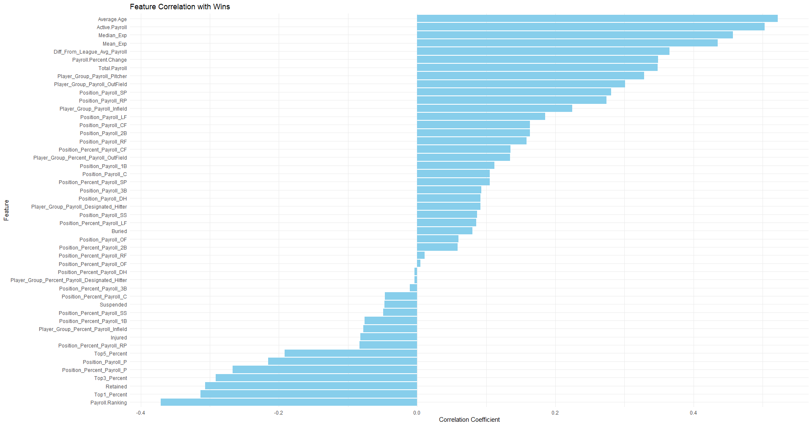
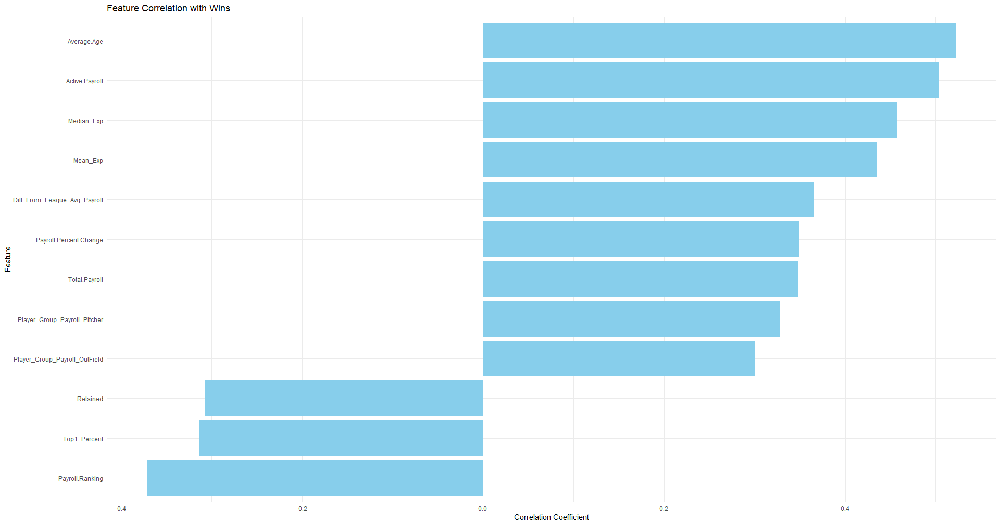
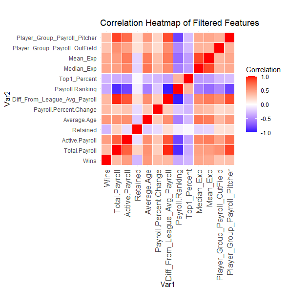
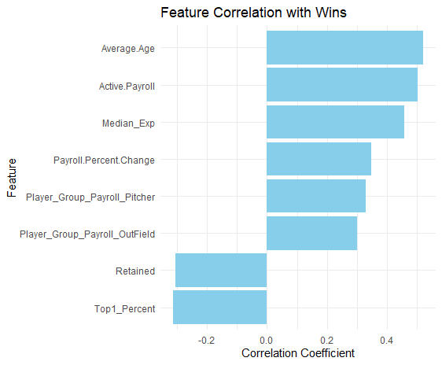

# Feature Selection

## Process
The feature selection process entails finding the most important features in predicting the "Wins" target variable. These features will then be used in the predictive modeling portion.     
The goal of this feature selection is to narrow down the predictive features from 53 to 5-8.  
Prior to feature selection methods, the data has been split into training and testing sets with an 80/20 split.  
Multiple feature selection methods wil be used to determine the most highly correlated as well as most important features associated with the "Wins" target variable.   
The dataset being used is the Predictive_MLB_Payroll_Data.csv, which contains 53 variables across 360 observations.

## Splitting the Data
The data was manually split into training and testing sets using an 80/20 split in order to avoid data leakage.  
```r
#setting the test and train sets
# Remove non-predictive and non-numeric columns
new_df <- ind_features_standardized[, !names(ind_features_standardized) %in% c("Team", "Year", "Playoff_Status")]
#Train/set 80/20
set.seed(123)
size <- floor(.8 * nrow(new_df))
train_ind <- sample(seq_len(nrow(new_df)), size=size)
train <- new_df[train_ind, ]
xtrain <- train[,2:49]
ytrain<- train[,1]
#Creating values not chosen
#test values
test <- new_df[-train_ind,]
xtest<-test[,2:49]
ytest<-test[,1]
```

## Filter Methods

### Correlation Coefficient
The correlation coefficient filter method is the first feature selection method used to gain an understanding and have an idea as to which features show the highest absolute correlation with the target variable "Wins".   

#### Feature Correlation with Wins


The plot shows all features and their correlation with target variable "Wins". It can be seen that there are 17 features with a negative correlation and 31 features with a positive correlation. 

A threshold of 0.3 was then applied to retain only the features that had a correlation of (absoulte value) 0.3 or greater, leaving with the following features;

#### Reduced Feature Correlation with Wins


The threshold of 0.3 narrowed down the number of features from 53 to 12.  
The correlation table for the remaining features is shown;

#### Threshold .03 Features
| Feature                                 | Correlation   |
|-----------------------------------------|---------------|
| Average.Age                             | 0.5220093     |
| Active.Payroll                          | 0.5030141     |
| Median_Exp                              | 0.4572524     |
| Mean_Exp                                | 0.4347328     |
| Diff_From_League_Avg_Payroll            | 0.3653672     |
| Payroll.Percent.Change                  | 0.3488771     |
| Total.Payroll                           | 0.3483478     |
| Player_Group_Payroll_Pitcher            | 0.3283856     |
| Player_Group_Payroll_OutField           | 0.3008260     |
| Retained                                | -0.3068963    |
| Top1_Percent                            | -0.3136713    |
| Payroll.Ranking                         | -0.3709405    |

The table shows the reamining features, but some of these features may have collinearity, such as Median_Exp and Mean_Exp.   
To test and correct for this, collinearity will be assess and any features in this group with a collinearity of .75 or higher will be dropped from the grouping. 

#### Reduced Feature Correlation Heatmap


The heatmap shows some of these features having high collinearity. Using the findCorrelation function, features are removed based on a heuristic that minimizes redundancy.
This leaves the remaining 8 features, which was the target number of features to use;

#### Final Feature Correlation with Wins


#### Correlation Analysis Features
| Feature                           | Correlation |
|-----------------------------------|-------------|
| Average.Age                       | 0.5220093   |
| Active.Payroll                    | 0.5030141   |
| Median_Exp                        | 0.4572524   |
| Payroll.Percent.Change            | 0.3488771   |
| Player_Group_Payroll_Pitcher      | 0.3283856   |
| Player_Group_Payroll_OutField     | 0.3008260   |
| Top1_Percent                      | -0.3136713  |
| Retained                          | -0.3068963  |

```r
#Save Corrlation Coefficient Features
write.csv(correlation_df, file = "CorrelationCoefFeaturesDF.csv", row.names = FALSE)
```
