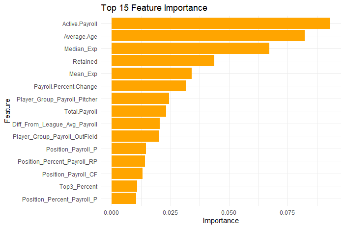
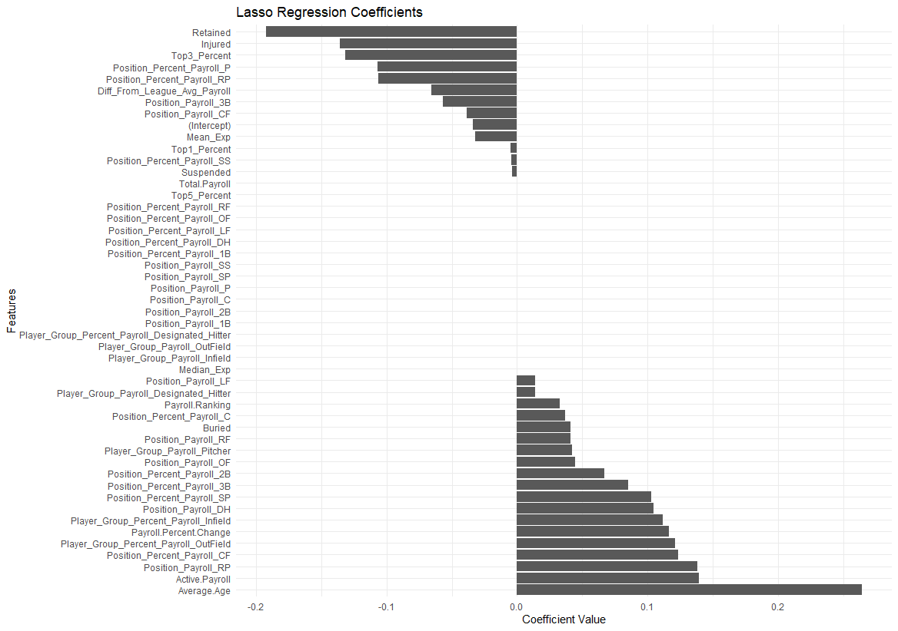
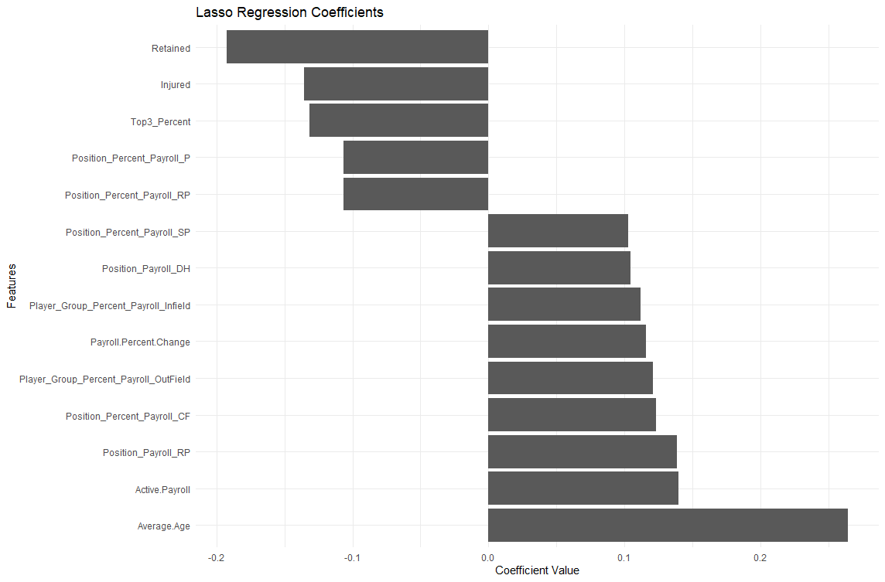
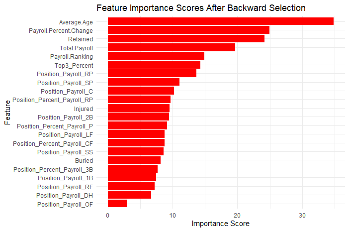

# Feature Selection

## Process
The feature selection process entails finding the most important features in predicting the "Wins" target variable. These features will then be used in the predictive modeling portion.     
The goal of this feature selection is to narrow down the predictive features from 53 to 5-8.  
Prior to feature selection methods, the data has been split into training and testing sets with an 80/20 split.  
Multiple feature selection methods wil be used to determine the most highly correlated as well as most important features associated with the "Wins" target variable.   
The dataset being used is the Predictive_MLB_Payroll_Data.csv, which contains 53 variables across 360 observations.

## Splitting the Data
The data was manually split into training and testing sets using an 80/20 split in order to avoid data leakage.  
```r
#setting the test and train sets
# Remove non-predictive and non-numeric columns
new_df <- ind_features_standardized[, !names(ind_features_standardized) %in% c("Team", "Year", "Playoff_Status")]
#Train/set 80/20
set.seed(123)
size <- floor(.8 * nrow(new_df))
train_ind <- sample(seq_len(nrow(new_df)), size=size)
train <- new_df[train_ind, ]
xtrain <- train[,2:49]
ytrain<- train[,1]
#Creating values not chosen
#test values
test <- new_df[-train_ind,]
xtest<-test[,2:49]
ytest<-test[,1]
```

## Filter Methods

### Correlation Coefficient
The correlation coefficient filter method is the first feature selection method used to gain an understanding and have an idea as to which features show the highest absolute correlation with the target variable "Wins".   

#### Feature Correlation with Wins


The plot shows all features and their correlation with target variable "Wins". It can be seen that there are 17 features with a negative correlation and 31 features with a positive correlation. 

A threshold of 0.3 was then applied to retain only the features that had a correlation of (absoulte value) 0.3 or greater, leaving with the following features;

#### Reduced Feature Correlation with Wins


The threshold of 0.3 narrowed down the number of features from 53 to 12.  
The correlation table for the remaining features is shown;

#### Threshold .03 Features
| Feature                                 | Correlation   |
|-----------------------------------------|---------------|
| Average.Age                             | 0.5220093     |
| Active.Payroll                          | 0.5030141     |
| Median_Exp                              | 0.4572524     |
| Mean_Exp                                | 0.4347328     |
| Diff_From_League_Avg_Payroll            | 0.3653672     |
| Payroll.Percent.Change                  | 0.3488771     |
| Total.Payroll                           | 0.3483478     |
| Player_Group_Payroll_Pitcher            | 0.3283856     |
| Player_Group_Payroll_OutField           | 0.3008260     |
| Retained                                | -0.3068963    |
| Top1_Percent                            | -0.3136713    |
| Payroll.Ranking                         | -0.3709405    |

The table shows the reamining features, but some of these features may have collinearity, such as Median_Exp and Mean_Exp.   
To test and correct for this, collinearity will be assess and any features in this group with a collinearity of .75 or higher will be dropped from the grouping. 

#### Reduced Feature Correlation Heatmap


The heatmap shows some of these features having high collinearity. Using the findCorrelation function, features are removed based on a heuristic that minimizes redundancy.
This leaves the remaining 8 features, which was the target number of features to use;

#### Final Feature Correlation with Wins


#### Correlation Analysis Features
| Feature                           | Correlation |
|-----------------------------------|-------------|
| Average.Age                       | 0.5220093   |
| Active.Payroll                    | 0.5030141   |
| Median_Exp                        | 0.4572524   |
| Payroll.Percent.Change            | 0.3488771   |
| Player_Group_Payroll_Pitcher      | 0.3283856   |
| Player_Group_Payroll_OutField     | 0.3008260   |
| Top1_Percent                      | -0.3136713  |
| Retained                          | -0.3068963  |

```r
#Save Corrlation Coefficient Features
write.csv(correlation_df, file = "CorrelationCoefFeaturesDF.csv", row.names = FALSE)
```
---

## Embedded Methods

### Random Forest Feature Selection Model
The random forest embedded method is the second feature selection used to gain an understanding and have an idea as to which features give the greatest contributions towards the model predicting "Wins".   


#### All Features' Importance Score
 


It can be seen in the plot that only six features hold an importance score of .025 or higher, while four features hold a negative importance score.   

#### Random Forest Feature Selection Error Metrics
| Metric                         | Value | Explanation                                                                 |
|--------------------------------|-------|-----------------------------------------------------------------------------|
| **Mean Absolute Error (MAE)**  | 0.61  | On average, predictions are 0.61 units away from actual values.              |
| **Mean Squared Error (MSE)**   | 0.57  | The average squared difference between predictions and actual values is 0.57.|
| **Root Mean Squared Error (RMSE)** | 0.76  | On average, predictions are 0.76 units away from actual values, considering larger errors more heavily.|
| **R-squared (R²)**             | 0.53  | The model explains 53% of the variance in the actual values.                 |  

It's important to understand the model's error metrics in order to compare to the other feature selection models to determine which may hold the most accuracy. 

#### Top 15 Important RF Features
  
Taking a closer look at the top 15 features from the model will help in reducing the number of features to the 5-8 feature range that is being aimed for.  
- Mean_Exp and Median_Exp are both in the top 10, so the less important one (Mean_Exp) will be removed 
- Active.Payroll and Retained are both subsets of Total.Payroll, but hold more importance, so Total.Payroll will be removed

This leaves 8 of the 10 most important variables based on the RF model. However, this is very similar (aside from difference from league average) to the grouping of features from the correlation analysis feature selection. So aside from the just mentioned features, 3 other of the highest ranked important features that were not an outcome of the correlation analysis will be used.  
Those 3 are: Diff_From_League_Avg_Payroll, Position_Percent_Payroll_RP, Top_3_Percent

#### Random Forest Features
| Feature                        | Importance |
|--------------------------------|------------|
| Active.Payroll                 | 0.09319288 |
| Average.Age                    | 0.08223427 |
| Median_Exp                     | 0.06712792 |
| Retained                       | 0.04367303 |
| Diff_From_League_Avg_Payroll   | 0.02043119 |
| Position_Percent_Payroll_RP    | 0.01427489 |
| Top3_Percent                   | 0.01076271 |

It's a good sign to conintually see similar features selected across models, as this tells me that they seem to be agreeing with eachother on the contributions certain features give towards modeling.  
However, since there is such a large discrepancy in importance from the first 4 features compared to the 3 added on, it may be beneficial to keep in mind the possibility of only using the those top 4 features when modeling.  

```r
#Save Random Forest Features
write.csv(RF_Df, file = "RandomForestFeaturesDF.csv", row.names = FALSE)
```

### L1 Regularization (Lasso Regression Model)
The lasso regression embedded method is the third feature selection used to gain an understanding and have an idea as to which features give the greatest contributions towards the model predicting "Wins".   

#### Lasso Feature Relationship
  
Lasso Regression shrinks the weight of less important features to zero, which can be seen within the plot here, leaving behind 31 features to be assesed.

#### Lasso Regression Feature Selection Error Metrics
| Metric                         | Value | Explanation                                                                 |
|--------------------------------|-------|-----------------------------------------------------------------------------|
| **Mean Squared Error (MSE)**   | 0.46  | The average squared difference between predictions and actual values is 0.46.|
| **R-squared (R²)**             | 0.53  | The model explains 53% of the variance in the actual values.                 |    

The Rsquared is very similar to that of the Random Forest Model, however the mean squared error is lower, indicating the lasso regression may be more reliable in terms of feature selection.      

#### Lasso Features with Coefficient magnitude >= .1


Of the 31 non-zero features, 14 had a coefficient maginute of greater than .1. For now, features from this list with a coefficient magnitude of .13 or greater will be kept, leaving with the 6 features shown below. However, a random forest model feature importance model may be used down the road on these remaining features to determine which should be kept. 

#### Lasso Regression Features
| Feature                                 | Coefficient |
|-----------------------------------------|-------------|
| Average.Age                             | 0.2644904   |
| Active.Payroll                          | 0.1395932   |
| Position_Payroll_RP                     | 0.1384407   |
| Top3_Percent                           | -0.1314580  |
| Injured                                | -0.1355215  |
| Retained                               | -0.1924657  |

There are some differences in the features found in the Lasso regression, but the similarity is found in the Average.Age, Active.Payroll, and Retained features.

```r
#Save Lasso Features
write.csv(Lasso_df, file = "LassoFeatures.csv", row.names = FALSE)
```

## Wrapper-Embedded Hybrid Method

### Backward Selection - Random Forest 
Embeedded wrapper hybrid method is advantageous because it combines the strengths of feature selection and model training, allowing the model to refine its feature set while simultaneously optimizing performance.


#### 1) Backwards Selection
Using the backwards selection stepwise regression model with all the features, select features will remain for feature importance identification with the randomforest model. In backwards selection, the variables are judged on how their interaction with the model affects the AIC. 

After implementing backward selection, 22 features remain;   
```r
> print(Backwards_Selection_features)
 [1] "Total.Payroll"               "Injured"                     "Retained"                    "Buried"                     
 [5] "Average.Age"                 "Payroll.Percent.Change"      "Payroll.Ranking"             "Top3_Percent"               
 [9] "Position_Payroll_1B"         "Position_Payroll_2B"         "Position_Payroll_C"          "Position_Payroll_DH"        
[13] "Position_Payroll_LF"         "Position_Payroll_OF"         "Position_Payroll_RF"         "Position_Payroll_RP"        
[17] "Position_Payroll_SP"         "Position_Payroll_SS"         "Position_Percent_Payroll_3B" "Position_Percent_Payroll_CF"
[21] "Position_Percent_Payroll_P"  "Position_Percent_Payroll_RP"
```

#### 2) Random Forest
A similar random forest model to the one used previously was utilized. 

#### Random Forest Backward Selection Feature Importance
    

#### Backward Selection Random Forest Error Metrics
| Metric                         | Value | Explanation                                                                 |
|--------------------------------|-------|-----------------------------------------------------------------------------|
| **Mean Absolute Error (MAE)**  | 0.62  | On average, predictions are 0.62 units away from actual values.              |
| **Mean Squared Error (MSE)**   | 0.57  | The average squared difference between predictions and actual values is 0.57.|
| **Root Mean Squared Error (RMSE)** | 0.75  | On average, predictions are 0.75 units away from actual values, considering larger errors more heavily.|
| **R-squared (R²)**             | 0.53  | The model explains 53% of the variance in the actual values.                 |

The error metrics from this random forest feature importance model are very similar to that of the previous random forest feature importance model. 

From this model, the 7 most important features will be taken into consideration for further modeling analysis. Those features are: 

#### Backward Selection - Random Forest Features
| Feature                       | Importance  |
|-------------------------------|-------------|
| Average.Age                   | 34.89545    |
| Payroll.Percent.Change        | 24.95703    |
| Retained                      | 24.17651    |
| Total.Payroll                 | 19.66369    |
| Top3_Percent                  | 14.26345    |
| Payroll.Ranking               | 14.87357    |
| Position_Payroll_RP           | 13.69533    |

Some of these features are similar to those already chosen to be used in modeling, some are not. 
```r
#Save Hybrid Features
write.csv(hybrid_df, file = "Hybrid_features.csv", row.names = FALSE)
```

## Selected Feature Overview
Throughout the feature selection process, there were 4 groups of features chosen to be used in the modeling portion of this analysis.  
Below is an overview of all the features chosen and the method by which they were selected. 


#### Consolidated Features Table
| Feature                           | Correlation Analysis Features   | Random Forest Features | Lasso Regression Features | Backward Selection - Random Forest Features |
|-----------------------------------|---------------------------------|------------------------|---------------------------|----------------------------------------------|
| Average.Age                       | ✓                               | ✓                      | ✓                         | ✓                                            |
| Active.Payroll                    | ✓                               | ✓                      | ✓                         |                                              |
| Median_Exp                        | ✓                               |                        |                           |                                              |
| Payroll.Percent.Change            | ✓                               |                        |                           | ✓                                            |
| Player_Group_Payroll_Pitcher      | ✓                               |                        |                           |                                              |
| Player_Group_Payroll_OutField     | ✓                               |                        |                           |                                              |
| Top1_Percent                      | ✓                               |                        |                           |                                              |
| Retained                          | ✓                               | ✓                      | ✓                         | ✓                                            |
| Diff_From_League_Avg_Payroll      |                                 | ✓                      |                           |                                              |
| Position_Percent_Payroll_RP       |                                 | ✓                      | ✓                         | ✓                                            |
| Total.Payroll                     |                                 |                        |                           | ✓                                            |
| Payroll.Ranking                   |                                 |                        |                           | ✓                                            |
| Injured                           |                                 |                        | ✓                         |                                              |
| Position_Payroll_RP               |                                 |                        | ✓                         | ✓                                            |
| Top3_Percent                      |                                 | ✓                      | ✓                         | ✓                                            |


file = "CorrelationCoefFeaturesDF.csv"   
file = "RandomForestFeaturesDF.csv"  
file = "LassoFeatures.csv"   
file = "Hybrid_features.csv" 

Of the 48 different variables available in the dataset, 15 have been found to be relevant and used within the modeling.  
Only two of the features were kept after all feature selection techniques; Average.Age and Retained.  
Each grouping has 6-8 features involved, which is a comfortable amount of features, but may want to be thinned out if models are not as accurate as hoped to be.  `
