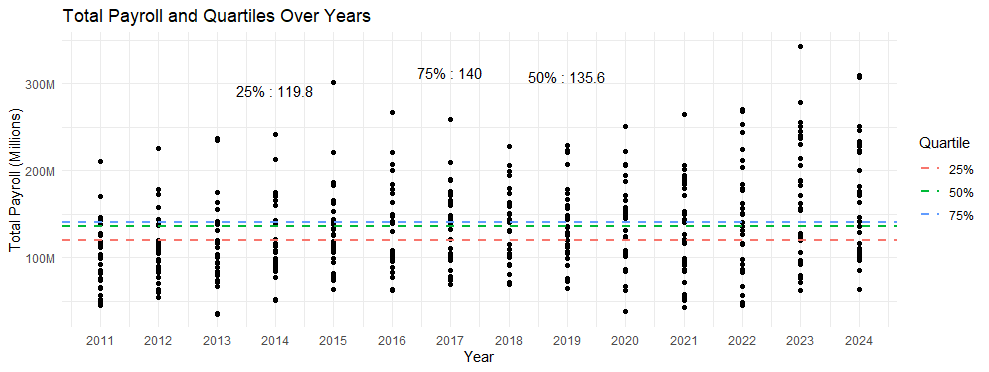
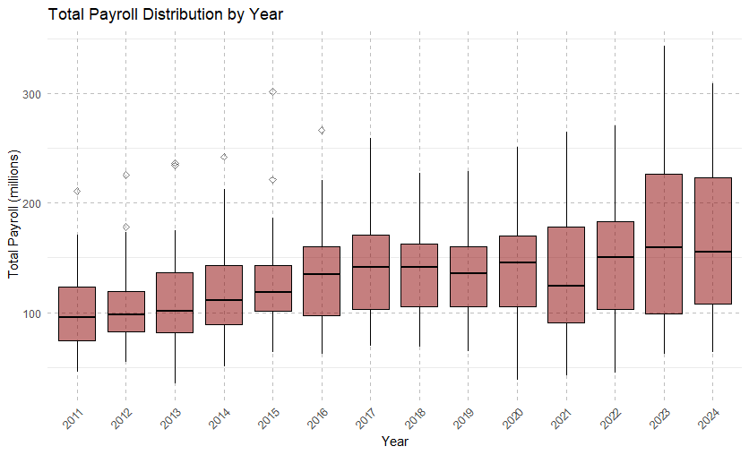
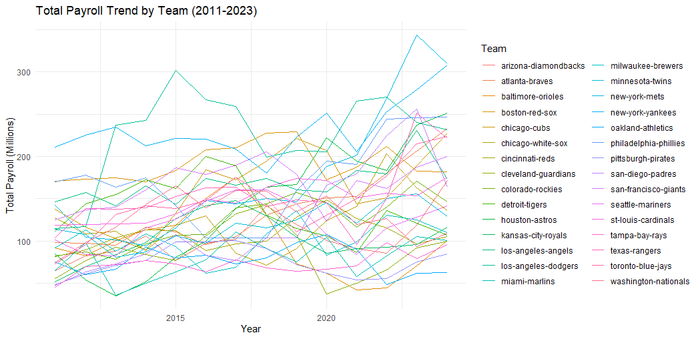
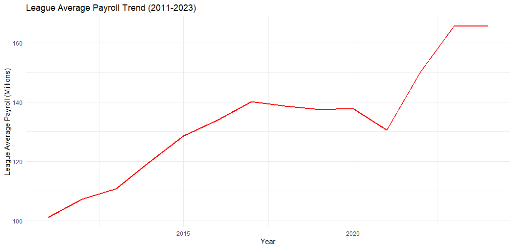
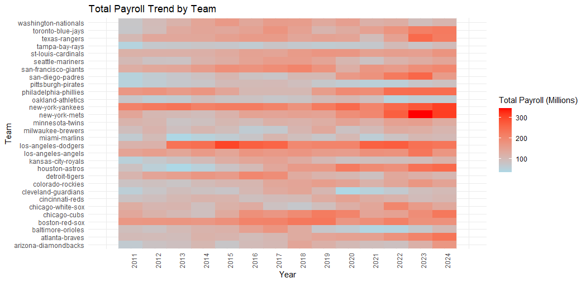
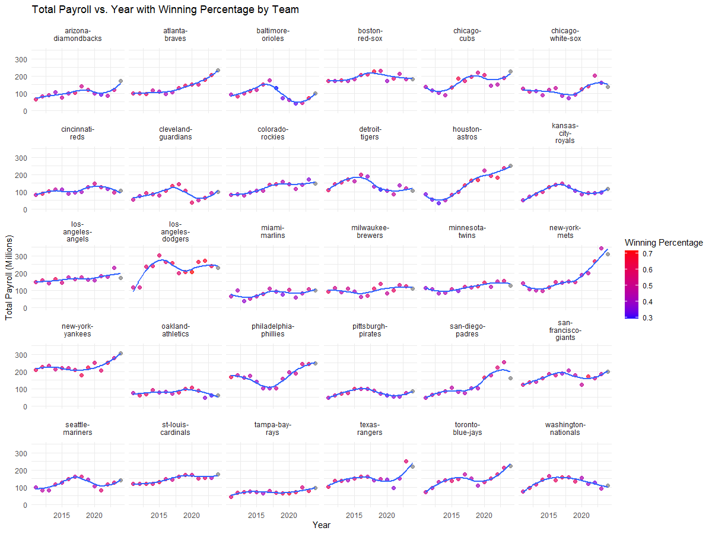
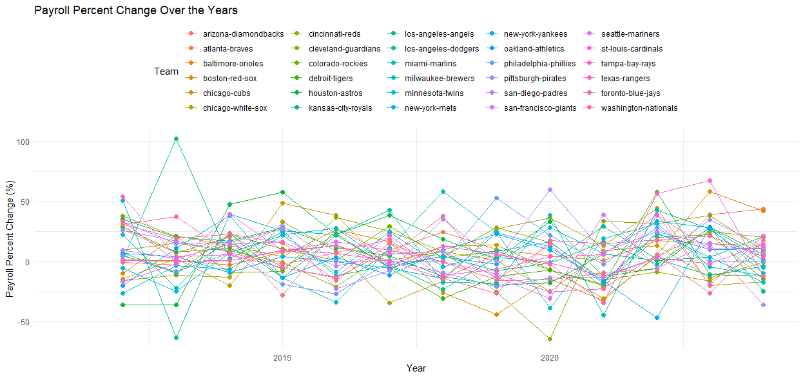
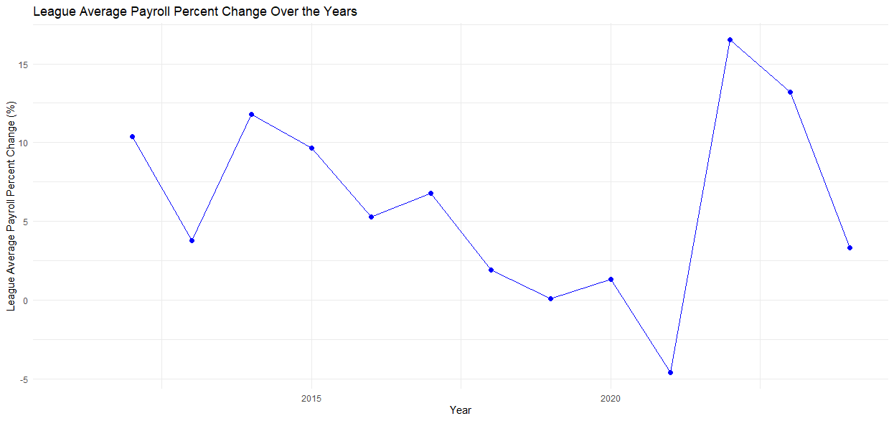
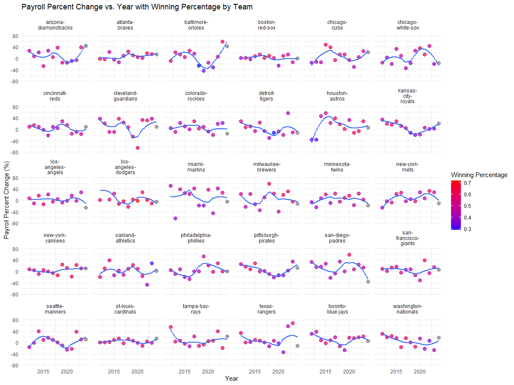
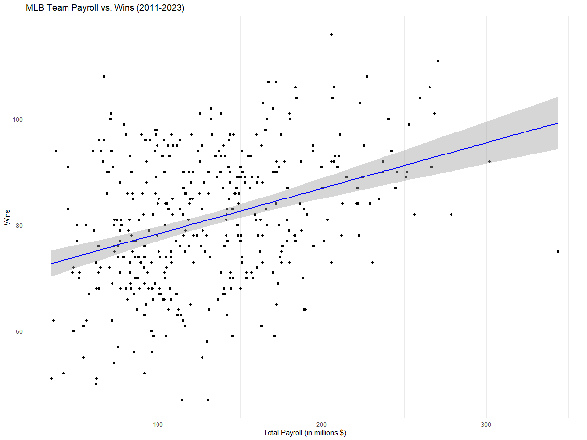

---
# Exploratory Data Analysis of MLB League Payroll Data
---

**Libraries Used:**   
library(ggplot2)  
library(dplyr)  
library(tidyr)  
library(shiny)  
library(scales)  
library(forcats)     

```r
#Creating a unique df so that the averages & medians aren't skewed. 
f <- read.csv("C:/Users/colet/Documents/Personal Projects/Completed_MLB_Payroll_Data.csv")
#creating unique df's
df <- f %>%
  distinct(Team, Year, .keep_all = TRUE)
```
# Summary Statistics

```r
#League Average Payroll
mean(df$League.Average.Payroll)
median(df$League.Average.Payroll)
print(paste("Minimum League Average Payroll value:", min(df$League.Average.Payroll, na.rm = TRUE), "Year:", df$Year[which.min(df$League.Average.Payroll)]))
print(paste("Maximum League Average Payroll value:", max(df$League.Average.Payroll, na.rm = TRUE), "Year:", df$Year[which.max(df$League.Average.Payroll)]))
#Team Total Payroll
mean(df$Total.Payroll)
median(df$Total.Payroll)
print(paste("Minimum total payroll value:", min(df$Total.Payroll, na.rm = TRUE), "Year:", df$Year[which.min(df$Total.Payroll)]))
print(paste("Maximum total payroll value:", max(df$Total.Payroll, na.rm = TRUE), "Year:", df$Year[which.max(df$Total.Payroll)]))
```

#### League Average & Total Payroll Statistics
| Statistic                                   | Value                | Year |
|---------------------------------------------|----------------------|------|
| Mean of League Average Payroll              | $133,375,546         |      |
| Median of League Average Payroll            | $135,648,515         |      |
| Mean of Total Payroll                       | $133,375,546         |      |
| Median of Total Payroll                     | $124,795,547         |      |
| Minimum League Average Payroll value        | $101,089,505.30      | 2011 |
| Maximum League Average Payroll value        | $165,757,214.66      | 2023 |
| Minimum Total Payroll value                 | $35,077,913          | 2013 |
| Maximum Total Payroll value                 | $343,605,067         | 2023 |


```r
# Compute quartiles for Total Payroll
quartiles <- quantile(df$Total.Payroll, probs = c(0.25, 0.5, 0.75), na.rm = TRUE)
# Find the corresponding years for each quartile
quartile_years <- sapply(quartiles, function(x) df$Year[which.min(abs(df$Total.Payroll - x))])
for (i in 1:length(quartiles)) {
  print(paste("Quartile", names(quartiles)[i], "value:", quartiles[i], "Year:", quartile_years[i]))}
#Compute quartiles for league average payroll
quartiles <- quantile(df$League.Average.Payroll, probs = c(0.25, 0.5, 0.75), na.rm = TRUE)
# Find the corresponding years for each quartile
quartile_years <- sapply(quartiles, function(x) df$Year[which.min(abs(df$League.Average.Payroll - x))])
for (i in 1:length(quartiles)) {
  print(paste("Quartile", names(quartiles)[i], "value:", quartiles[i], "Year:", quartile_years[i]))}
```

#### Quartiles for Total Payroll
| Quartile | Value            | Year |
|----------|------------------|------|
| 25%      | $92,819,736.75   | 2014 |
| 50%      | $124,795,546.50  | 2020 |
| 75%      | $165,347,359.50  | 2014 |
  

#### Quartiles for League Average Payroll
| Quartile | Value               | Year |
|----------|---------------------|------|
| 25%      | $119,756,506.93     | 2014 |
| 50%      | $135,648,514.67     | 2019 |
| 75%      | $140,038,982.60     | 2017 |

# Visualizations


### Quartile Distributions

```r
quartiles_millions <- as.numeric(quartiles) / 1e6
quartile_data <- data.frame(
  Quartile = names(quartiles),
  Value = quartiles_millions,
  Year = quartile_years
)

# Plot the data
ggplot(df, aes(x = Year, y = Total.Payroll / 1e6)) +
  geom_point() +  # Scatter plot of all data points
  geom_hline(data = quartile_data, aes(yintercept = Value, color = Quartile), linetype = "dashed", size = 1) +
  geom_text(data = quartile_data, aes(x = Year, y = Value, label = paste(Quartile, ":", round(Value, 1))), vjust = -12) +
  labs(title = "Total Payroll and Quartiles Over Years",
       x = "Year",
       y = "Total Payroll (Millions)") +
  theme_minimal() +
  scale_y_continuous(labels = function(x) paste0(x, "M"))+  # Adjust y-axis labels to show values in millions
  scale_x_continuous(breaks = seq(min(df$Year), max(df$Year), by = 1))  # Include all years
```

  
  
This plot shows the distribution of total payroll across years

---

```r
#customization of the box plot
ggplot(df, aes(x = as.factor(Year), y = Total.Payroll / 1000000)) +
  geom_boxplot(fill = "darkred", color = "black", alpha = 0.5, outlier.shape = 5) +  # Customize box plot appearance
  scale_y_continuous(labels = label_number_si()) +  # Format y-axis labels
  labs(title = "Total Payroll Distribution by Year",  # Add title and axis labels
       x = "Year",
       y = "Total Payroll (millions)") +
  theme_minimal() +  # Apply a minimal theme
  theme(axis.text.x = element_text(angle = 45, hjust = 1),  # Rotate x-axis labels
        panel.grid.major = element_line(color = "gray", linetype = "dashed"),  # Customize grid lines
        legend.position = "bottom")  # Adjust legend position
```

    
  
  This boxplot tells me that more teams are increasing their total payroll such that enough teams have increased payroll over this time so outliers no longer exist (in terms of team payroll), even with the maximum total payroll being at an all time high over the past couple years.
  Minimum payroll is not increasing by too much, telling me that there are larger discrepancies between teams with low and high ranked payrolls. Would imagine sooner than later a minimum payroll would become the outlier. The median payroll kept a somewhat steady rise, 
  showing that the league is trending in a direction that spends more on total payroll (as expected).
  
---

### Total Payroll Trends

```r
# Yearly total payroll trend for all teams
ggplot(df, aes(x = Year, y = Total.Payroll / 1e6, group = Team, color = Team)) +
  geom_line() +
  labs(title = "Total Payroll Trend by Team (2011-2023)",
       x = "Year", y = "Total Payroll (Millions)") +
  theme_minimal()

# Yearly league average payroll trend
ggplot(df, aes(x = Year, y = League.Average.Payroll / 1e6)) +
  geom_line(color = "red", size = 1) +
  labs(title = "League Average Payroll Trend (2011-2023)",
       x = "Year", y = "League Average Payroll (Millions)") +
  theme_minimal()
```





The first plot shows all teams yearly payrolls from 2011 to 2024. Not easy to understand when looking at it, so a second plot of league average payroll over the years was created. There is an evident increase in the yearly league average payroll.

---

```r
#Heatmap that shows total payroll for each team over the years
ggplot(df, aes(x = Year, y = Team, fill = Total.Payroll / 1e6)) +
  geom_tile() +
  scale_fill_gradient(low = "light blue", high = "red") +
  labs(title = "Total Payroll Trend by Team",
       x = "Year",
       y = "Team",
       fill = "Total Payroll (Millions)") +
  scale_x_continuous(breaks = seq(2011, max(df$Year)), limits = c(2010,2025)) +
  theme_minimal() +
  theme(axis.text.x = element_text(angle = 90, hjust = 1))
```


This heatmap shows each team's total payroll from 2011 to 2024. This is a much more team specific way in understanding how each team's payroll has changed as well as how it compares to other team payrolls. 

---

```r
# Plotting total payroll with winning percentage by color, faceted by team
ggplot(df, aes(x = Year, y = Total.Payroll / 1e6, color = W.L.)) +
  geom_point(size = 3, alpha = 0.7) +  # Scatter plot with constant size and adjusted transparency
  facet_wrap(~ Team, labeller = as_labeller(function(x) str_wrap(x, width = 10))) +  # Facet by team
  labs(x = "Year", y = "Total Payroll (Millions)",
       title = "Total Payroll vs. Year with Winning Percentage by Team",
       color = "Winning Percentage") +
  scale_color_gradient(low = "blue", high = "red") +  # Color gradient for winning percentage
  geom_smooth(method = "loess", se = FALSE) +  # Add smooth trend lines
  theme_minimal() +
  coord_cartesian(ylim = c(0, max(df$Total.Payroll / 1e6, na.rm = TRUE)))  # Set y-axis limits globally
```



This plot shows each team's individual total payroll over the years (in millions), including a trend line for the total payroll, as well as win percentage shown by the coloring of the circles. Looking across all the plots, it seems evident that teams with low losing percentages in early years that sharply increased their payroll also increased their winning percentage. There could be an argument that for any teams that have red(ish) circles below the trend line were overachieving and any teams that had blue(ish) dots above the trend line were underachieving.

---

### Percent Change Trends

```r
# Filter data for relevant columns
payroll_change <- df[, c("Team", "Year", "Payroll.Percent.Change")]
# Plotting using ggplot2
ggplot(payroll_change, aes(x = Year, y = Payroll.Percent.Change, group = Team, color = Team)) +
  geom_line() +  # Line plot
  geom_point(size = 2) +  # Points for each year
  labs(x = "Year", y = "Payroll Percent Change (%)",
       title = "Payroll Percent Change Over the Years",
       color = "Team") +
  theme_minimal() +
  theme(legend.position = "top")  # Position legend at the top
# Calculate league average percent change by year
league_avg_change <- df %>%
  group_by(Year) %>%
  summarise(Avg_Payroll_Percent_Change = mean(Payroll.Percent.Change, na.rm = TRUE)) %>%
  ungroup()
# Print the first few rows to verify
print(head(league_avg_change))
# Plotting league average percent change
ggplot(league_avg_change, aes(x = Year, y = Avg_Payroll_Percent_Change)) +
  geom_line(color = "blue") +  # Line plot
  geom_point(size = 2, color = "blue") +  # Points for each year
  labs(x = "Year", y = "League Average Payroll Percent Change (%)",
       title = "League Average Payroll Percent Change Over the Years") +
  theme_minimal()
```




The first plot shows the percent change for all teams from one year to the next, while the second plot shows the average percent change for the entire league. It is evident that covid has caused an anomaly from 2020 to 2022. This must be taken into consideration before running machine learning analyses.   
The plots do show a small decrease in league average percent change. This could help make sense of why there is a larger discrepancy between team total payrolls shown earlier, as there is less percent change per year but increases in the median average payroll.

---

```r
# Plotting payroll percent change with winning percentage by color, faceted by team
ggplot(df, aes(x = Year, y = Payroll.Percent.Change, color = W.L.)) +
  geom_point(size = 3, alpha = 0.7) +  # Scatter plot with constant size and adjusted transparency
  facet_wrap(~ Team, labeller = as_labeller(function(x) str_wrap(x, width = 10))) +  # Facet by team
  labs(x = "Year", y = "Payroll Percent Change (%)",
       title = "Payroll Percent Change vs. Year with Winning Percentage by Team",
       color = "Winning Percentage") +
  scale_color_gradient(low = "blue", high = "red") +  # Color gradient for winning percentage
  geom_smooth(method = "loess", se = FALSE) +  # Add smooth trend lines
  theme_minimal() +
  coord_cartesian(ylim = c(-75, 75))  # Set y-axis limits globally
```



This plot shows each indiviudal team's percent change over the years (with a trend line) as well the team's win percentage in form of color mapping on the circle (the grey circles denote this year, which has no win information). There is a lot of information held within this plot, but it is interesting to see how teams that had a smaller jump in percent change from covid typically don't do as well as the teams with the largers jumps. This may say something about increasing payroll from year to year and how it could help a team win. 

---
### Trend Analysis

```r
# Create the scatter plot with payroll in millions, a trend line, and correlation coefficient
ggplot(df, aes(x = Total.Payroll / 1e6, y = Wins)) +
  geom_point() +
  geom_smooth(method = "lm", col = "blue") +
  labs(title = "MLB Team Payroll vs. Wins (2011-2023)",
       x = "Total Payroll (in millions $)",
       y = "Wins") +
  theme_minimal() +
  annotate("text", x = max(df$Total.Payroll) / 1e6, y = min(df$Wins), 
           label = paste("Correlation: ", round(cor_coeff, 2)), 
           hjust = 1, vjust = -1, size = 5)
```

The plot shows the correlation between a team's total payroll and total wins with confidence intervals. It's evident that there is a direct correlation between wins and total payroll, although it does not seem to be too strong.


--- 

```r
# Filter data for teams that won the World Series
won_teams <- df[df$World.Series == "Won", ]
# Summarize team statistics
team_stats <- won_teams %>%
  group_by(Team, Abbreviation, Year) %>%
  summarise(Total_Payroll = mean(Total.Payroll, na.rm = TRUE),  
            Win_Percentage = mean(W.L., na.rm = TRUE), .groups = 'drop')  # win percentage for each team in each year
# Reorder teams by Win_Percentage
team_stats <- team_stats %>%
  mutate(Team = fct_reorder(Team, Win_Percentage, .desc = TRUE))

# Define the new color gradient for Win_Percentage (blue to red)
team_palette <- scale_fill_gradient(low = "blue", high = "red",
                                    limits = range(team_stats$Win_Percentage),
                                    breaks = pretty_breaks(n = 5))
# Average league payroll by year
league_avg_payroll <- df %>%
  group_by(Year) %>%
  summarise(League_Average_Payroll = mean(League.Average.Payroll, na.rm = TRUE))
# Plot the data
ggplot() +
  geom_bar(data = team_stats, aes(x = Year, y = Total_Payroll / 1e6, fill = Win_Percentage), stat = "identity", position = "dodge") +
  geom_point(data = league_avg_payroll, aes(x = Year, y = League_Average_Payroll / 1e6), color = "black", size = 3, shape = 1) +  # Add points for league average payroll
  labs(x = "Year", y = "Total Payroll (Millions)",
       title = "Total Payroll vs. Year for Teams that Won the World Series",
       fill = "Win Percentage") +
  team_palette +  # Use the new custom color palette
  theme_minimal() +
  scale_y_continuous(labels = function(x) paste0(x, "M")) +  # Format y-axis labels in millions
  scale_x_continuous(breaks = seq(min(df$Year), max(df$Year), by = 1)) +  # Include all years
  theme(axis.text.x = element_text(angle = 45, hjust = 1)) +  # Rotate x-axis labels for better readability
  geom_text(data = team_stats, aes(x = Year, y = Total_Payroll / 1e6, label = Abbreviation), 
            position = position_dodge(width = 0.9), vjust = -0.5, size = 3, color = "black")  # Adjust vertical position, text size, and color     
```
  

This plot shows the world series winning teams plotted against their total payroll, with the color mapping identifying their win percentage. The league average payroll for that season is marked by the unfilled circle.   
A slight increase can be seen in the total payroll of the teams that have won the world series, which should be expected with the increase in total payroll shown earlier. The win percentage for teams was also seen as sporadic. However, what remained consistent is that almost every team (aside from 3) have been above the league average payroll.

---
