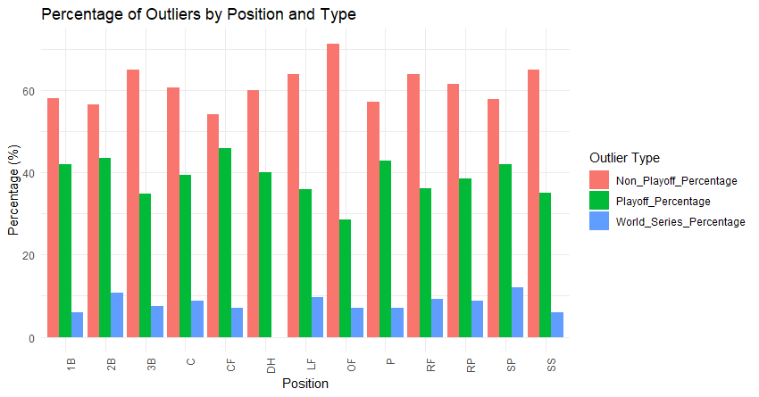
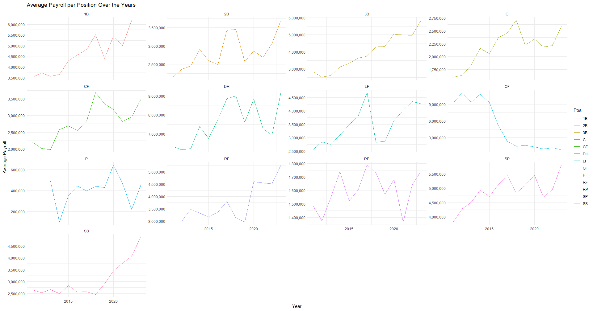
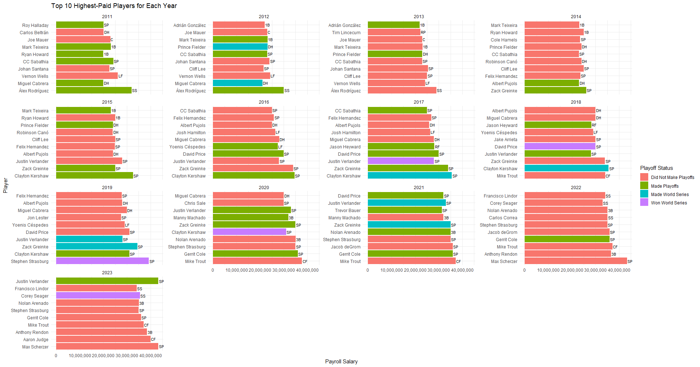
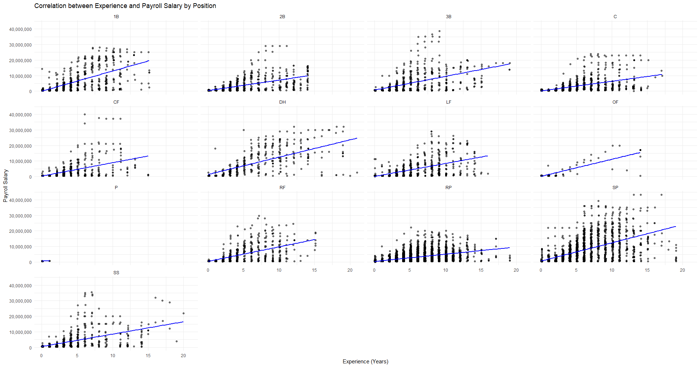

---
# Exploratory Data Analysis of Player and Position Payroll Distribution
---
This EDA will explore player salary/payroll distribution along with a breakdown by player position of all the teams throughout the league from the years 2011 through 2023 (important to note 2024 data will not be in this EDA). Teams will be broken up into groupings of world series, playoffs, and no playoffs
to understand the significance of positional payroll distribution. 

**Libraries Used:**  
library(ggplot2)  
library(dplyr)  
library(tidyr)  
library(shiny)  
library(scales)  
library(forcats)  

```r
df <- read.csv("C:/Users/colet/Documents/Personal Projects/Completed_MLB_Payroll_Data.csv")
colnames(df)
unique_df <- df %>%
  distinct(Team, Year, .keep_all = TRUE)
# Create a new dataframe that only has teams which did make the playoffs
all_teams <- df %>%
  filter(Year != 2024)
# Create a new dataframe that only has teams which did make the playoffs
playoff_teams <- df %>%
  filter(Year != 2024, 
         Playoff_Status > 0)
# Create a new dataframe that only has teams which did not make the playoffs
dnp_playoff_teams <- df %>%
  filter(Year != 2024, 
         Playoff_Status == 0)
# Create a new dataframe that only has teams which made WS
ws_teams <- df %>%
  filter(Year != 2024, 
         Playoff_Status >= 4)
```


# Summary Statistics
### Payroll Salary

### Player Summary Statistics
| Pos | Mean_Payroll_Salary | Median_Payroll_Salary | SD_Payroll_Salary | Max_Payroll_Salary | Mean_Exp   | Median_Exp | Count |
|-----|---------------------|-----------------------|-------------------|--------------------|------------|------------|-------|
| 1B  | $4,659,240          | $1,000,000            | $6,697,879        | $28,088,462        | 4.25 years | 3.11 years | 922   |
| 2B  | $2,812,941          | $700,000              | $4,279,949        | $29,000,000        | 4.22 years | 3.07 years | 983   |
| 3B  | $3,911,911          | $720,000              | $6,032,981        | $38,571,428        | 4.36 years | 3.10 years | 935   |
| C   | $2,191,394          | $579,100              | $3,859,302        | $23,875,000        | 3.98 years | 3.08 years | 1364  |
| CF  | $2,800,800          | $589,650              | $5,222,041        | $40,000,000        | 3.41 years | 2.13 years | 691   |
| DH  | $7,548,430          | $4,085,310            | $8,119,585        | $32,000,000        | 6.50 years | 5.15 years | 528   |
| LF  | $3,372,945          | $700,000              | $5,201,588        | $29,000,000        | 4.37 years | 3.12 years | 1065  |
| OF  | $2,278,603          | $570,500              | $4,401,099        | $20,000,000        | 3.02 years | 1.06 years | 197   |
| P   | $440,679            | $555,000              | $409,682          | $3,175,000         | 0.12 years | 0.04 years | 153   |
| RF  | $3,632,013          | $730,000              | $5,217,110        | $29,666,666        | 4.13 years | 3.08 years | 848   |
| RP  | $1,599,438          | $564,500              | $2,480,540        | $22,250,000        | 3.32 years | 2.10 years | 6676  |
| SP  | $4,926,624          | $1,000,000            | $6,992,401        | $43,333,333        | 4.51 years | 3.15 years | 2897  |
| SS  | $3,149,586          | $700,000              | $5,500,142        | $35,500,000        | 3.95 years | 3.05 years | 873   |
| All | $3,006,983	        | $650,560              | $5,105,337        | $43,333,333        | 3.95 years | 3.03 years | 18,132|


Across the league, it can be seen that first base has the highest average and median payroll salary, (aside from DH, but for the sake of count value and lack of consistency in players, that position will be overlooked) while relief pitchers tend to have the lowest. However, the starting pitcher position has the highest payroll salary
of any position, but also has the greatest standard deviation. It's also interesting to see that the starting pitcher position has the highest mean and median experience of all the positions. 

### Did Not Make Playoffs Player Summary Statistics
| Pos | Mean_Payroll_Salary | Median_Payroll_Salary | SD_Payroll_Salary | Max_Payroll_Salary | Mean_Exp   | Median_Exp | Count |
|-----|---------------------|-----------------------|-------------------|--------------------|------------|------------|-------|
| 1B  | $4,251,698          | $857,000              | $6,300,276        | $28,088,462        | 4.13 years | 3.06 years | 633   |
| 2B  | $2,462,808          | $700,000              | $3,749,467        | $25,454,545        | 3.76 years | 2.17 years | 676   |
| 3B  | $3,731,560          | $720,000              | $5,860,543        | $38,571,428        | 4.15 years | 3.07 years | 668   |
| C   | $2,014,100          | $573,884              | $3,696,712        | $23,050,000        | 3.72 years | 3.00 years | 954   |
| CF  | $2,583,255          | $575,000              | $5,315,028        | $40,000,000        | 3.20 years | 2.10 years | 457   |
| DH  | $7,239,479          | $3,666,667            | $8,279,923        | $32,000,000        | 6.30 years | 5.08 years | 357   |
| LF  | $3,121,245          | $624,000              | $5,041,910        | $29,000,000        | 3.96 years | 3.04 years | 737   |
| OF  | $1,803,998          | $570,500              | $3,725,442        | $20,000,000        | 2.02 years | 1.01 years | 141   |
| P   | $489,550            | $555,000              | $436,166          | $3,175,000         | 0.12 years | 0.04 years | 116   |
| RF  | $3,513,746          | $721,311              | $5,115,372        | $29,666,666        | 4.03 years | 3.07 years | 584   |
| RP  | $1,435,005          | $563,500              | $2,201,471        | $22,250,000        | 3.03 years | 2.05 years | 4699  |
| SP  | $4,443,626          | $750,000              | $6,462,159        | $43,333,333        | 4.23 years | 3.10 years | 1965  |
| SS  | $2,928,011          | $700,000              | $5,040,007        | $35,100,000        | 3.88 years | 3.04 years | 607   |
| All | $2,735,701          | $589,500              | $4,787,801        | $43,333,333	       | 3.66 years | 2.15 years | 12594 |

Specifically looking at the teams that did not make the playoffs from 2011-2023, it is seen that the starting pitcher position has the highest mean payroll salary, and 2nd highest median payroll salary behind first base. Starting pitching continues to have the highest payroll salary as well as standard deviation.

### Playoff Player Summary Statistics
| Pos | Mean_Payroll_Salary | Median_Payroll_Salary | SD_Payroll_Salary | Max_Payroll_Salary | Mean_Exp   | Median_Exp | Count |
|-----|---------------------|-----------------------|-------------------|--------------------|------------|------------|-------|
| 1B  | $5,549,065          | $1,100,000            | $7,427,259        | $27,638,462        | 4.50 years | 4.07 years | 289   |
| 2B  | $3,586,677          | $889,754              | $5,189,936        | $29,000,000        | 5.11 years | 4.06 years | 307   |
| 3B  | $4,362,451          | $1,000,000            | $6,432,988        | $35,050,000        | 4.85 years | 3.15 years | 267   |
| C   | $2,603,061          | $700,000              | $4,188,573        | $23,875,000        | 4.53 years | 4.05 years | 410   |
| CF  | $3,225,619          | $720,000              | $5,019,541        | $22,000,000        | 3.80 years | 3.04 years | 234   |
| DH  | $8,189,958          | $5,225,000            | $7,760,647        | $29,000,000        | 6.87 years | 6.04 years | 171   |
| LF  | $3,941,973          | $1,000,000            | $5,511,392        | $27,500,000        | 5.28 years | 5.04 years | 328   |
| OF  | $3,469,430          | $570,500              | $5,624,824        | $17,050,000        | 5.34 years | 2.13 years | 56    |
| P   | $285,921            | $165,300              | $260,572          | $720,000           | 0.07 years | 0.07 years | 37    |
| RF  | $3,896,294          | $919,126              | $5,438,370        | $28,166,667        | 4.36 years | 3.16 years | 264   |
| RP  | $1,990,320          | $575,000              | $3,007,650        | $20,000,000        | 3.98 years | 3.07 years | 1977  |
| SP  | $5,946,112          | $2,300,000            | $7,904,420        | $43,333,333        | 5.07 years | 4.04 years | 932   |
| SS  | $3,660,136          | $700,000              | $6,418,021        | $35,500,000        | 4.10 years | 3.05 years | 266   |
| All | $3,624,623          | $722,950              | $5,716,034        | $43,333,333        | 4.54 years | 3.15 years | 5538  |

Specifically looking at the teams that did make the playoffs from 2011-2023, first base and starting pitching are the two most highly invested in positions, while also holding the highest standard deviations amonst any positions as well. 

### World Series Player Summary Statistics
| Pos | Mean_Payroll_Salary | Median_Payroll_Salary | SD_Payroll_Salary | Max_Payroll_Salary | Mean_Exp   | Median_Exp | Count |
|-----|---------------------|-----------------------|-------------------|--------------------|------------|------------|-------|
| 1B  | $4,978,924          | $1,000,000            | $6,650,772        | $27,638,462        | 3.62 years | 3.03 years | 57    |
| 2B  | $4,296,981          | $1,125,000            | $6,344,091        | $29,000,000        | 6.80 years | 6.10 years | 68    |
| 3B  | $3,904,328          | $715,300              | $5,515,381        | $20,000,000        | 4.17 years | 3.03 years | 60    |
| C   | $2,745,433          | $722,500              | $4,177,084        | $23,875,000        | 4.43 years | 4.00 years | 79    |
| CF  | $2,220,770          | $570,500              | $3,610,943        | $17,500,000        | 2.87 years | 2.10 years | 54    |
| DH  | $7,813,060          | $4,850,000            | $7,439,284        | $23,750,000        | 7.03 years | 6.04 years | 38    |
| LF  | $4,401,624          | $1,523,907            | $5,552,229        | $21,857,142        | 5.63 years | 5.61 years | 69    |
| OF  | $5,567,663          | $735,000              | $6,641,360        | $17,050,000        | 5.94 years | 5.55 years | 14    |
| P   | $280,312            | $185,791              | $246,783          | $570,500           | NA         | NA         | 12    |
| RF  | $3,942,173          | $764,200              | $5,458,817        | $21,666,666        | 3.54 years | 2.16 years | 55    |
| RP  | $2,077,364          | $708,500              | $3,000,208        | $18,250,000        | 3.90 years | 3.05 years | 417   |
| SP  | $7,349,747          | $3,814,890            | $9,197,819        | $43,333,333        | 5.67 years | 5.00 years | 193   |
| SS  | $3,454,371          | $700,000              | $6,298,129        | $35,500,000        | 3.52 years | 3.05 years | 61    |
| All | $3,860,880          | $750,000              | $6,015,127        | $43,333,333        | 4.57 years | 3.14 years | 1177  |

Specifically looking at the teams that made it to the world series from 2011-2023, it's seen that starting pithing celars all other positions in terms of payroll but still holds the highest standard deviation out of all too. 


---

In summary looking across all 4 charts, Infield Positions (1B, 2B, 3B, C, SS): Generally show higher salaries and experience in playoff teams. Non-playoff teams pay less and have lower experience levels.
Outfield Positions (CF, LF, RF): Similar to infield positions, with higher salaries and experience for playoff teams.Pitchers (P, RP, SP): Higher salaries and experience for playoff teams, with starting pitchers commanding the highest pay and experience.
General Trend: Playoff teams invest more in key positions, reflected in higher salaries and more experienced players. Non-playoff teams typically have lower salaries and less experienced players in these roles.
It's tough to immediately say whether there are important positional payroll trends occuring by taking a first glance at the summary statistics tables, but more digging can definitely be done to create a better understanding. 

---

### Outlier Inspection
```r
# Function to calculate outliers and their playoff status counts
calculate_outliers <- function(df) {
  df <- df %>% filter(!is.na(Payroll.Salary))
  Q1 <- quantile(df$Payroll.Salary, 0.25)
  Q3 <- quantile(df$Payroll.Salary, 0.75)
  IQR <- Q3 - Q1
  lower_bound <- Q1 - 1.5 * IQR
  upper_bound <- Q3 + 1.5 * IQR
```
Standard IQR formula was used to caluclate the outliers for each position. They were then broken down into playoffs, no playoffs, and world series.  It should also be noted that all the outliers are present only beyond the upper percentiles, not the lower.

### Payroll Salary Outliers
| Pos | Total_Outliers | Playoff_Outliers (%) | Non_Playoff_Outliers (%) | World_Series_Outliers (%) |
|-----|----------------|----------------------|--------------------------|---------------------------|
| RP  | 1059           | 408 (38.5%)          | 651 (61.5%)              | 94 (8.9%)                 |
| SP  | 226            | 95 (42.0%)           | 131 (58.0%)              | 27 (11.9%)                |
| C   | 193            | 76 (39.4%)           | 117 (60.6%)              | 17 (8.8%)                 |
| LF  | 125            | 45 (36.0%)           | 80 (64.0%)               | 12 (9.6%)                 |
| 2B  | 122            | 53 (43.4%)           | 69 (56.6%)               | 13 (10.7%)                |
| 1B  | 119            | 50 (42.0%)           | 69 (58.0%)               | 7 (5.9%)                  |
| SS  | 117            | 41 (35.0%)           | 76 (65.0%)               | 7 (6.0%)                  |
| 3B  | 106            | 37 (34.9%)           | 69 (65.1%)               | 8 (7.5%)                  |
| CF  | 98             | 45 (45.9%)           | 53 (54.1%)               | 7 (7.1%)                  |
| RF  | 97             | 35 (36.1%)           | 62 (63.9%)               | 9 (9.3%)                  |
| OF  | 42             | 12 (28.6%)           | 30 (71.4%)               | 3 (7.1%)                  |
| P   | 14             | 6 (42.9%)            | 8 (57.1%)                | 1 (7.1%)                  |
| DH  | 5              | 2 (40.0%)            | 3 (60.0%)                | 0 (0.0%)                  |
| **Total** | **2223** | **905 (40.7%)**      | **1318 (59.3%)**         | **205 (9.2%)**            |

The outliers for each position, whether they made the playoffs (or world series) or not, and the percentage that grouping of outliers makes up for all the outliers in that position is shown in this table. The goal was to have an undesrtanding of outlier distribution to determine whether having an outlier in a certain position results in better team performance or not.   
The highest percentages of outliers in playoff teams are: 
1) Center Field
2) Second Base
3) Starting Pitcher & First Base

What this tells me is that teams that make the playoffs tend to non-outliers in most positions (say, pay the league norm) but have outliers in the mentioned positions.
On the other end, it is also important to understand what teams who aren't making the playoffs are doing in order to avoid following in their footsteps.   
The highest percentages of outliers in non-playoff teams are:
1) Third Base
2) Short Stop
3) Left Field

It's interesting to see that the third base and short stop positions have the highest percentages of outliers on non-playoff teams. These positions are typically played by the most athletic players on the team, which leads me to think that teams are willing to overpay for players in these positions, resulting in a lack
of funds to support high end players in the other positions, resulting in a team that cannot make the playoffs. 

  
The plot visualizes what was just shown and discussed within the tables. Do note the y-axis is percentage rather than count of outliers. 

---
# Visualizing

### Time Series of Average Payroll by Position


A steady increase at all positions can be seen, however it is expected to be a rugged increase, as certain players retire and no longer are on large contracts, and younger players continue to play on a rookie contract. It's interesting to see the shortstop position with such a sharp and steady increase, which
could be saying that several shortstops were signed to large contracts recently but successively (year after year), resulting in the large and constant increase in average payroll salary. 

### Top 10 Highest Salaried Players per Year


This plot is interesting to look at as it can be seen that, for the most part, every year at least half of the highest paid players in the league do not make the playoffs and even less often don't make it to the world series. This plot can tell the story of both good and bad - teams should not spend too much money on a player and focus on building a full team as more often than not that player's team does not even make the playoffs. However, the other end of this says that a top 10 paid player has made the world series in 7 of the last 13 seasons. Ultimately, there is a high risk high reward system being shown. 

---



This is a correlation plot that shows how age and payroll salary are directly related over time. The importance of this plot was not to see if there was a correlation between positional payroll salary and experience, because it only makes sense that there is, the point of the plot was to understand which position had the highest
correlation between experience and payroll salary. The numeric representation of the correlations can be seen below in the table:   

| Pos | Correlation |
|-----|-------------|
| OF  | 0.858       |
| DH  | 0.667       |
| 1B  | 0.665       |
| SP  | 0.635       |
| P   | 0.609       |
| LF  | 0.594       |
| RF  | 0.591       |
| 2B  | 0.590       |
| RP  | 0.579       |
| 3B  | 0.554       |
| C   | 0.545       |
| SS  | 0.531       |
| CF  | 0.503       |

Based on the correlations, it's seen (ignoring only OF and P) that DH and 1B have the highest correlations with payroll salary. This may be becuase these positions more easily retain the players value with age because they are less stressful positions on the body, meaning players can play more impactfully at these positions late
into their careers, allowing them to sign larger contracts at these spots (with experience).   
It's not surprising to see the opposite of this happening with the shortstop and centerfield positions. Although they clearly have a direct positive relationship between payroll salary and exp, they are not nearly as high as the DH or 1B positions
because they are the most high stress positions on the field, meaning with experience comes age, and with age comes a reduction in athleticism, and at the most athletic positions on the field a team wants the most athleticism. Therefore, a much smaller correlation at these positions makes sense.  
