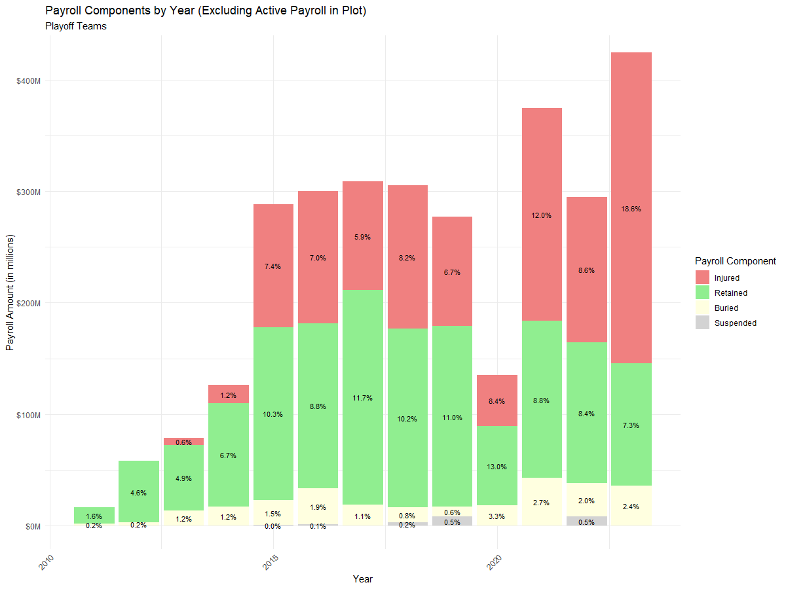
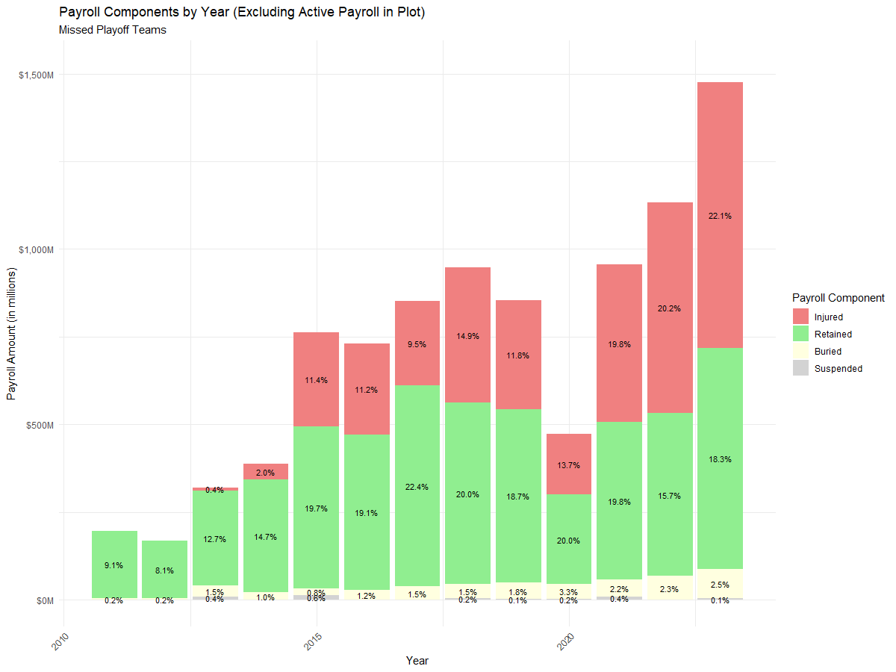

---
# Exploratory Data Analysis of Playoff and World Series Teams' Payroll Data
---
This EDA will look into the payrolls of all teams that had made the playoffs from the years 2011 through 2023 (important to note 2024 data will not be in this EDA) separately from the teams that did not make the playoffs each year. The two teams that made the world series in each of these years will also be analyzed along the way.   
Subsetted dataframes have been created to hold data of playoff, world series, and non-playoff teams.  

**Libraries Used:**  
library(ggplot2)  
library(dplyr)  
library(tidyr)  
library(shiny)  
library(scales)  
library(forcats)  


```r
# Create a new dataframe that only has teams which have made the playoffs
playoff_teams <- df %>%
  filter(World.Series %in% c("Won", "Lost") |
           ALCS %in% c("Won", "Lost") |
           NLCS %in% c("Won", "Lost") |
           AL.Division.Series %in% c("Won", "Lost") |
           NL.Division.Series %in% c("Won", "Lost") |
           Wild.Card.Game %in% c("Won", "Lost"))
# Create a new dataframe that only has teams which did not make the playoffs
dnp_playoff_teams <- df %>%
  filter(World.Series %in% c("DNP", "DNP") &
           ALCS %in% c("DNP", "DNP") &
           NLCS %in% c("DNP", "DNP") &
           AL.Division.Series %in% c("DNP", "DNP") &
           NL.Division.Series %in% c("DNP", "DNP") &
           Wild.Card.Game %in% c("DNP", "DNP"))
# Create a new dataframe that only has teams which have made the ws
world_series_teams  <- df %>%
  filter(World.Series %in% c("Won", "Lost"))
```


# Summary Statistics

```r
# Function to bin teams based on payroll rankings and calculate percentages
bin_and_summarize_teams <- function(df, team_type) {
  df <- df %>%
    mutate(Payroll_Ranking_Bin = case_when(
      Payroll.Ranking <= 5 ~ "Top 5",
      Payroll.Ranking <= 10 ~ "Top 10",
      Payroll.Ranking <= 15 ~ "Top 15",
      Payroll.Ranking > 15 & Payroll.Ranking <= 30 ~ "Bottom 15",
      TRUE ~ "Other"  # Handle any other cases if needed
    ))
  
  payroll_bin_percentages <- df %>%
    group_by(Payroll_Ranking_Bin) %>%
    summarise(
      Unique_Teams = n(),
      Percentage = (Unique_Teams / n_distinct(df)) * 100  # Percentage based on the number of teams in the bin
    ) %>%
    arrange(match(Payroll_Ranking_Bin, c("Top 5", "Top 10", "Top 15", "Bottom 15", "Other")))
  
  cat(paste0("# ", team_type, " Summary\n"))
  print(payroll_bin_percentages)
  cat("\n")
}
```

<div style="display: flex; justify-content: space-between;">
  <!-- First table: Playoff Teams Payroll Ranking Breakdown -->
  <table>
    <tr>
      <th colspan="3">Playoff Teams Payroll Ranking Breakdown</th>
    </tr>
    <tr>
      <th>Payroll_Ranking_Bin</th>
      <th>Unique_Teams</th>
      <th>Percentage</th>
    </tr>
    <tr>
      <td>Top 5</td>
      <td>35</td>
      <td>28.7%</td>
    </tr>
    <tr>
      <td>Top 10</td>
      <td>26</td>
      <td>21.3%</td>
    </tr>
    <tr>
      <td>Top 15</td>
      <td>19</td>
      <td>15.6%</td>
    </tr>
    <tr>
      <td>Bottom 15</td>
      <td>42</td>
      <td>34.4%</td>
    </tr>
  </table>

  <!-- Second table: World Series Teams Payroll Ranking Breakdown -->
  <table>
    <tr>
      <th colspan="3">World Series Teams Payroll Ranking Breakdown</th>
    </tr>
    <tr>
      <th>Payroll_Ranking_Bin</th>
      <th>Unique_Teams</th>
      <th>Percentage</th>
    </tr>
    <tr>
      <td>Top 5</td>
      <td>10</td>
      <td>38.5%</td>
    </tr>
    <tr>
      <td>Top 10</td>
      <td>7</td>
      <td>26.9%</td>
    </tr>
    <tr>
      <td>Top 15</td>
      <td>2</td>
      <td>7.69%</td>
    </tr>
    <tr>
      <td>Bottom 15</td>
      <td>7</td>
      <td>26.9%</td>
    </tr>
  </table>

  <!-- Third table: DNP Breakdown -->
  <table>
    <tr>
      <th colspan="3">Missed Playoffs Teams Breakdown</th>
    </tr>
    <tr>
      <th>Payroll_Ranking_Bin</th>
      <th>Unique_Teams</th>
      <th>Percentage</th>
    </tr>
    <tr>
      <td>Top 5</td>
      <td>30</td>
      <td>11.2%</td>
    </tr>
    <tr>
      <td>Top 10</td>
      <td>39</td>
      <td>14.6%</td>
    </tr>
    <tr>
      <td>Top 15</td>
      <td>46</td>
      <td>17.2%</td>
    </tr>
    <tr>
      <td>Bottom 15</td>
      <td>153</td>
      <td>57.1%</td>
    </tr>
  </table>
</div>


From 2011 through 2023, nearly 65% of all teams that had made the playoffs had a payroll ranking of 1st-15th, whereas only 35% of teams in the playoffs had a payroll ranking from 16th-30th (which would be the bottom 15 payroll ranks).  
Nearly 75% of all teams that had made the world series had a payroll ranking of 1st-15th, whereas about 25% of teams in the world series had a payroll ranking from 16th-30th. However, it is impressive that 25% of teams with a 15th-30th payroll ranking have made the world series, as of the 
teams that made playoffs, only 35% had this payroll ranking.   
It can also be seen that 38.5% of teams that have made the world series have a payroll ranking from 1st-5th, which is the second highest percentage seen for any ranking bucket between the three tables.  
56% of all teams that have not made the playoffs have a payroll ranking from 16th-30th, which should be an immediate signifier for teams to spend more money and try to stay out of the bottom 15 payroll rankings.   
Simply looking at these tables may give early insight to one of the research questions, frankly stating yes, increasing payroll gives increased chances at making the playoffs as well as the world series. 

--- 

```r
# Defining a function to calculate summary statistics for a given dataframe
calculate_summary <- function(df) {
  summary <- df %>%
    summarise(
      avg_total_payroll = mean(Total.Payroll, na.rm = TRUE),
      median_total_payroll = median(Total.Payroll, na.rm = TRUE),
      avg_payroll_percent_change = mean(Payroll.Percent.Change, na.rm = TRUE),
      median_payroll_percent_change = median(Payroll.Percent.Change, na.rm = TRUE),
      avg_payroll_difference = mean(Payroll.Difference, na.rm = TRUE),
      median_payroll_ranking = median(Payroll.Ranking, na.rm = TRUE),
      avg_win_percentage = mean(`W.L.`, na.rm = TRUE),
      avg_wins = mean(Wins, na.rm = TRUE),
      avg_losses = mean(Losses, na.rm = TRUE),
      avg_age = mean(Average.Age, na.rm = TRUE),
      avg_experience = mean(Exp, na.rm = TRUE),
      avg_injured_payroll = mean(Injured, na.rm = TRUE),
      avg_suspended_payroll = mean(Suspended, na.rm = TRUE),
      avg_retained_payroll = mean(Retained, na.rm = TRUE)
    )
  return(summary)
}

```
(The code above only shows playoff summary, but the same is repeated for world series and whole league stats)  


### Summary Statistics of Payroll and Performance in Major League Baseball from 2011-2023

| Statistic                         | Entire League           | Missed Playoffs Teams   | Playoff Teams           | World Series Teams     |
|-----------------------------------|-------------------------|-------------------------|-------------------------|------------------------|
| Average Total Payroll             | $130,900,634            | $121,261,211            | $152,075,760            | $159,033,536           |
| Median Total Payroll              | $121,379,204            | $112,055,346            | $143,865,124            | $148,268,020           |
| Average Payroll Percent Change    | 6.35%                   | 2.51%                   | 14.66%                  | 13.59%                 |
| Median Payroll Percent Change     | 5.43%                   | 1.17%                   | 10.45%                  | 8.88%                  |
| Average Payroll Difference        | $5,388,975              | $728,011                | $15,446,846             | $13,764,860            |
| Median Payroll Ranking            | 15.50                   | 18.00                   | 10.50                   | 7.50                   |
| Average Win Percentage            | 50.00%                  | 46.20%                  | 58.35%                  | 59.39%                 |
| Average Wins                      | 80.98                   | 74.82                   | 94.52                   | 96.23                  |
| Average Losses                    | 81.02                   | 87.18                   | 67.48                   | 65.77                  |
| Average Age                       | 27.85                   | 27.60                   | 28.39                   | 28.40                  |
| Average Experience                | 4.75                    | 4.47                    | 5.32                    | 6.74                   |
| Average Injured Payroll           | $16,337,702             | $17,501,925             | $13,721,471             | $15,277,480            |
| Average Suspended Payroll         | $3,289,866              | $3,215,600              | $3,463,154              | $1,000,000             |
| Average Retained Payroll          | $17,661,419             | $19,849,059             | $12,725,207             | $14,224,511            |


The monetary summaries are the most important values to observe when looking across with the whole league summary. Clearly, there is a trend of teams that spend more money have a greater chance of making the playoffs (and world series) than teams that don't. It is interesting to
see that the average and median percent chnage is highest for world series teams, which could speak towards teams spending more money and acquiring free agent talent in the offseason, which could be the difference maker for a team to make it that far. Another interesting aspect is that 
world series and playoff teams seem to spend less money on players that don't play - what is meant by that is the combined payroll of injured, suspended and retained for playoff and world series teams is much lower than that of teams that did not make playoffs.  

---

    


#### Quartiles for Total Payroll of Playoff Teams
| Quartile         | Value                | Year |
|------------------|----------------------|------|
| Quartile 25%     | $106,496,179.75      | 2016 |
| Quartile 50%     | $143,865,124.50      | 2019 |
| Quartile 75%     | $192,441,727.50      | 2021 |

#### Quartiles for Total Payroll of Missed Playoff Teams
| Statistic        | Value            | Year |
|------------------|------------------|------|
| Quartile 25%     | $85,838,560.25   | 2020 |
| Quartile 50%     | $112,055,346     | 2013 |
| Quartile 75%     | $150,152,186.50  | 2021 |

#### Quartiles for Total Payroll of WS Teams
| Statistic        | Value            | Year |
|------------------|------------------|------|
| Quartile 25%     | $119,491,397.75  | 2023 |
| Quartile 50%     | $148,268,020.50  | 2021 |
| Quartile 75%     | $191,754,655     | 2021 |


It's remarkable to see the data laid out as quartiles. Half of the teams from 2011-2023 that missed the playoffs had a payroll of $112,055,346 and below whereas half the teams that made the playoffs in that time had a payroll of $143,865,124 or higher. This leaves us with a discrepancy of roughly $30million, which in a year could be two real contributors to a team. However, it isn't necessarily surprising for teams to make playoffs when they spend more money, as this would hypothetically mean they are acquiring better players.   
When analyzing these quartiles, it's important to keep in mind that the world series teams are included in the playoff teams quartiles. 


# Visualizations
---


 


In the plots above, the first shows the sum of payrolls for playoff teams and missed playoff teams in each year, the second shows the perecentage of the entire league payroll these teams take up, and the third shows the difference of the sums from each year (with a trend line). These plots give a visual understanding to the total difference of payrolls between playoff and nonplayoff teams. Although the trend line shows a steady increase in the difference between the sum of playoff and nonplayoff teams, the percentage of total league payroll reamins fairly consistent.   
It's seen that playoff teams mostly hold between 35%-40% of total league payroll, which would make sense as 10 teams, or 33% of teams, make the playoffs, and it would be expected that that amount of total league payroll (and more) would consist of playoff teams' payroll. 

---




### Total Component Breakdown by Playoff Status

| Year | Percentage Injured (Playoff) | Percentage Injured (Missed Playoff) | Percentage Retained (Playoff) | Percentage Retained (Missed Playoff) | Percentage Buried (Playoff) | Percentage Buried (Missed Playoff) | Percentage Suspended (Playoff) | Percentage Suspended (Missed Playoff) |
|------|------------------------------|--------------------------------------|-------------------------------|-------------------------------------|-----------------------------|-----------------------------------|-------------------------------|--------------------------------------|
| 2011 | 0.0%                         | 0.0%                                 | 1.64%                         | 9.12%                               | 0.17%                       | 0.18%                             | 0.0%                          | 0.0%                                 |
| 2012 | 0.0%                         | 0.0%                                 | 4.64%                         | 8.12%                               | 0.24%                       | 0.17%                             | 0.0%                          | 0.0%                                 |
| 2013 | 0.6%                         | 0.4%                                 | 4.90%                         | 12.7%                               | 1.16%                       | 1.49%                             | 0.0%                          | 0.45%                                |
| 2014 | 1.2%                         | 2.0%                                 | 6.67%                         | 14.7%                               | 1.24%                       | 0.95%                             | 0.0%                          | 0.0%                                 |
| 2015 | 7.4%                         | 11.4%                                | 10.3%                         | 19.7%                               | 1.49%                       | 0.77%                             | 0.03%                         | 0.55%                                |
| 2016 | 7.0%                         | 11.2%                                | 8.8%                          | 19.1%                               | 1.90%                       | 1.21%                             | 0.06%                         | 0.0%                                 |
| 2017 | 5.9%                         | 9.5%                                 | 11.7%                         | 22.4%                               | 1.13%                       | 1.49%                             | 0.0%                          | 0.0%                                 |
| 2018 | 8.2%                         | 14.9%                                | 10.2%                         | 20.0%                               | 0.83%                       | 1.50%                             | 0.20%                         | 0.21%                                |
| 2019 | 6.7%                         | 11.8%                                | 11.0%                         | 18.7%                               | 0.61%                       | 1.80%                             | 0.54%                         | 0.07%                                |
| 2020 | 8.4%                         | 13.7%                                | 13.0%                         | 20.0%                               | 3.32%                       | 3.28%                             | 0.0%                          | 0.22%                                |
| 2021 | 12.0%                        | 19.8%                                | 8.8%                          | 19.8%                               | 2.69%                       | 2.20%                             | 0.0%                          | 0.39%                                |
| 2022 | 8.6%                         | 20.2%                                | 8.4%                          | 15.7%                               | 1.98%                       | 2.28%                             | 0.53%                         | 0.0%                                 |
| 2023 | 18.6%                        | 22.1%                                | 7.3%                          | 18.3%                               | 2.37%                       | 2.46%                             | 0.0%                          | 0.11%                                |

Earlier in the analysis, it was said that playoff teams tend to have more players on their active payroll than that missed playoff teams. In these plots and table, it is evident that this is true.   
Playoff teams have a lower percentage of players not playing - whether that be on the injured list, retained, or suspended (buried is not entirely a lower percentage, but still majority lower). Prioritizing player health may be one of the most important things a team could do to help differentiate and get them into the playoffs. Aside from player health, front offices should do all things to avoid spending a percentage of payroll on players who are no longer playing for the team - as in retained percentages are much higher for that of missed playoff teams than they are for playoff teams. 
